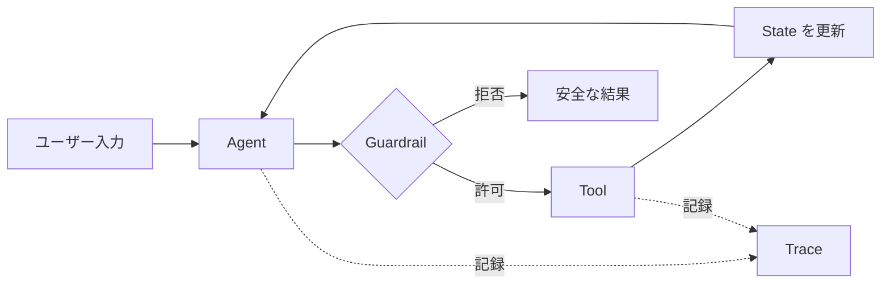

# Agent SDK入門：自律的な処理を組み立てる

Agent SDK は、単発の API 呼び出しではなく、**状況を読み、ツールを選び、必要なら複数の手順を進める処理**を組み立てるための SDK。特定の製品名ではなく、agent を扱う SDK に共通する設計要素を説明する。

## 普通のSDKとの違い

普通の SDK は、開発者が呼ぶ関数と順番を決める。

```python
weather = client.weather.get(city="Tokyo")
message = client.messages.create(text=weather.summary)
```

Agent SDK では、開発者は目的・利用可能なツール・制約を定義し、agent が途中の手順を選ぶ。

```text
目的: 「東京の天気を調べて、傘が必要か答える」
利用可能なツール: weather.get
制約: 天気情報が取得できないときは推測しない
```

自由度が増えるぶん、観測・制限・失敗時の扱いが重要になる。

## Agent SDKを構成する部品



Agent は Tool を直接の権限として持つのではなく、入力・実行・結果・状態更新を制御ループとして扱う。Guardrail と Trace は後から足す飾りではなく、このループを安全に観測・制限するための部品よ。

```text
Agent SDK
├─ Agent       役割・指示・モデル設定
├─ Tool        外部の機能を呼ぶ安全な窓口
├─ State       会話や作業の途中状態
├─ Runner      agentを一歩ずつ進める実行器
├─ Handoff     別の専門agentへ渡す仕組み
├─ Guardrail   入出力やツール呼び出しの制約
└─ Trace       何を考え、何を呼んだかの記録
```

### AgentとToolを分ける

Agent は判断する側、tool は実際に作用する側。tool を普通の関数として設計すると、テストしやすく、アクセス権を狭くできる。

```python
def get_weather(city: str) -> dict:
    """天気サービスから観測値を取得する。"""
    return {"city": city, "rain_probability": 70}


weather_agent = Agent(
    instructions="天気を根拠に、傘が必要かだけを答える",
    tools=[get_weather]
)
```

ここで agent に `delete_all_files` のような強い tool を渡せば、判断が少しずれただけで影響が大きくなる。tool は目的別に小さく分け、入力・出力・権限を明確にする。

## State：一回の会話より長い仕事を扱う

agent の処理は一度で終わらないことがある。ユーザーの選択待ち、外部 API の失敗、別 agent への引き継ぎが起きるから。

```text
state
├─ user_request: "来週の出張を予約して"
├─ destination: "Tokyo"
├─ dates: null
├─ tool_results: []
└─ status: "waiting_for_dates"
```

state を明示すると、途中で止まっても再開しやすい。逆に、全文の会話ログだけへ依存すると、どの値が確定済みか、どの tool を実行済みかが曖昧になる。

## Handoff：専門性と責任を分ける

一つの agent に全部を任せるより、役割ごとに agent を分ける場合がある。

```text
旅行agent
  ├─ 日程が未確定 → 確認質問をする
  ├─ 航空券が必要 → flight_agentへ handoff
  └─ 予算確認が必要 → budget_agentへ handoff
```

handoff では、何を渡すかを決める。会話全体、確定した state、権限、失敗履歴を無差別に渡すと、情報漏えいと混乱の原因になる。必要な最小コンテキストだけ渡す。

## Guardrail：できることより、してはいけないこと

Agent SDK では guardrail が特に重要。典型的には次を制限する。

| 境界 | 例 |
| --- | --- |
| 入力 | 個人情報を含む依頼を別フローへ送る |
| 出力 | 根拠がない医療・法律判断を断定しない |
| tool | 本番DBの削除、送信、購入は人の承認なしに実行しない |
| 回数 | 同じ tool を無限に呼ばない |
| 予算 | 最大実行時間、トークン、外部APIコストを上限で止める |

```text
agentが送信案を作る        → 許可
agentがメールを送信する    → ユーザー承認が必要
```

この違いを SDK の機能として表せると、安全な agent を作りやすい。判断と副作用を同じ関数へ混ぜないこと。

## Trace：結果だけでなく経路を残す

agent は同じ質問でも tool の順番や入力が変わることがある。最終回答だけでは、失敗や高コストの原因を追えない。

```text
trace
1. user input を受け取る
2. weather.get("Tokyo") を呼ぶ
3. tool result: rain_probability=70
4. 「傘が必要」と回答する
```

trace には秘密情報をそのまま残さない。入力・出力・トークン・認証ヘッダーをマスキングし、必要な期間だけ保持する。観測性とプライバシーはトレードオフじゃなく、両方を設計する対象。

## 実装前チェック

- agent の目的を一文で説明できるか
- tool は小さく、入出力と権限が定義されているか
- 副作用のある操作に承認地点があるか
- state の保存・再開・破棄が決まっているか
- handoff で渡す情報を最小化しているか
- ループ、時間、コストを止める上限があるか
- trace に何を残し、何を伏せるか決めているか

Agent SDK は「賢い関数」を呼ぶためのものじゃない。判断、実行、状態、責任、観測を分けて、自律的な処理を運用可能にするための枠組みなのよ。
