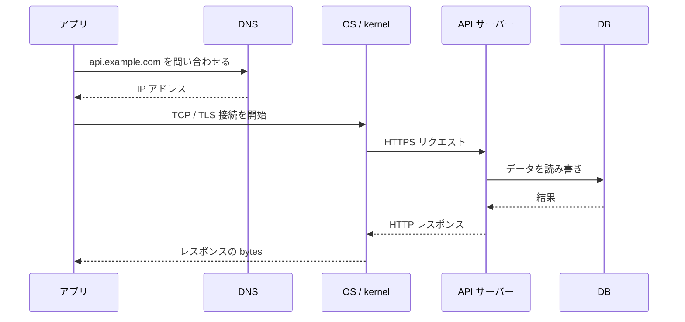

# APIの内部：DNSからカーネルまで

API を `fetch()` や `curl` で呼ぶと一行に見える。でも OS とネットワークの中では、名前解決、暗号化、接続、プロセス間の受け渡し、ディスク読み書きが連鎖している。



アプリから見れば `fetch()` は一行でも、下では名前解決・接続・暗号化・サーバー処理が順に走る。遅い、つながらない、といった障害はこの経路のどこで止まったかとして切り分ける。

## 1. URLをIPアドレスへ変える：DNS

`https://api.example.com/books/42` のホスト名は、そのままではネットワークに送れない。OS は DNS に問い合わせて、接続先の IP アドレスを得る。

```text
api.example.com → 203.0.113.42
```

この結果は OS やブラウザが一定時間キャッシュする。DNS が遅い・失敗するなら、HTTP サーバーへはまだ一文字も届いていない。`curl` が「名前解決できない」と出すのはこの段階の問題。

## 2. TCPは「届いた順に読む」ための通路

IP はパケットを届けようとするだけで、順番・重複・欠落までは面倒を見ない。Web API でよく使う TCP は、その上で順序と再送を扱う。

```text
クライアント                         サーバー
SYN      ─────────────────────────→  接続を始めたい
         ←─────────────────────────  SYN + ACK
ACK      ─────────────────────────→  接続成立
```

この三者のやりとりが TCP の three-way handshake。成立後、アプリは「バイト列のストリーム」を読んだり書いたりできる。途中でパケットが落ちても TCP が再送するため、HTTP 側は基本的に順番どおりのデータを受け取れる。

ただし接続確立には往復時間がかかる。遠いリージョンの API が遅い理由は、サーバー処理だけじゃない。DNS と TCP の往復も最初の待ち時間に入る。

## 3. TLSは「誰と話しているか」と「盗み見されないか」

`https` では TCP 接続の後に TLS handshake が起きる。クライアントはサーバー証明書を検証し、共通鍵を安全に共有して、その後の HTTP 本文を暗号化する。

```text
https://api.example.com
  └─ DNSでIPを得る
  └─ TCP接続を作る
  └─ TLSで証明書を確認し暗号鍵を合意する
  └─ 暗号化したHTTPを送る
```

証明書が期限切れ、ホスト名が一致しない、信頼できない発行者なら接続は止まる。これは API の認証トークンより前の層。`Authorization: Bearer ...` を送る前に、安全な通信路を作れている必要がある。

## 4. HTTPはTCPの中へ流すメッセージ形式

接続ができた後、HTTP が URL、メソッド、ヘッダー、本文を決める。

```http
GET /books/42 HTTP/1.1
Host: api.example.com
Accept: application/json
Authorization: Bearer <token>
```

OS から見ると、これはソケットに書かれたバイト列。Web フレームワークから見ると、`method`、`path`、`headers`、`body` に分解済みのリクエスト。層ごとに見え方が変わる。

## 5. ソケットはアプリとカーネルの受け渡し口

ソケットは「ネットワーク接続を表す OS の資源」。クライアントもサーバーも、ソケットを通じてカーネルへ送受信を頼む。

```text
アプリの process
  write(socket, request bytes)
        ↓
OS kernel の送信バッファ
        ↓
NIC（ネットワークカード）→ ネットワーク
```

サーバー側では逆に、カーネルの受信バッファから Web サーバーのプロセスが読み取る。プロセスが遅いと受信キューがたまり、接続数が多いとファイルディスクリプタやメモリが尽きる。これは「API が遅い」を OS レベルで見る入口になる。

## 6. サーバープロセスはリクエストを仕事へ振り分ける

Nginx やロードバランサが接続を受け、アプリケーションプロセスへ渡す構成はよくある。

```text
client
  → load balancer
  → Nginx
  → application process
  → database process
```

アプリは JSON を読み、認証し、ビジネスロジックを実行する。CPU を使う計算ならプロセスやスレッドが忙しくなる。DB 待ちや外部 API 待ちなら、処理は I/O 待ちになる。CPU 使用率だけ見ても遅さの原因は分からない、ということ。

## 7. データベースとディスク：成功はメモリだけでは終わらない

`POST /orders` が注文を作るとき、アプリは DB へ SQL を送る。DB はバッファキャッシュ、ロック、トランザクションログ、ディスク書き込みを使い、永続化を成立させる。

```text
HTTP request
  → application
  → BEGIN
  → INSERT orders ...
  → transaction log
  → COMMIT
  → HTTP 201 response
```

ここで `201 Created` を返すタイミングは設計判断になる。停電後も注文が残る保証が必要なら、少なくとも DB がコミットを確定した後に返すべき。速さだけを理由に、永続化前に成功を返すとデータ不整合を作る。

## 障害を層で切り分ける

| 症状 | 疑う層 | 最初の確認 |
| --- | --- | --- |
| ホスト名を解決できない | DNS | DNS設定、名前解決結果 |
| 接続がタイムアウトする | ルーティング・FW・TCP | IP/ポート、ネットワークポリシー |
| 証明書エラー | TLS | 証明書、SNI、時刻 |
| `401` / `403` | HTTP・認証 | ヘッダー、トークン、権限 |
| `500` | アプリ・DB | アプリログ、依存先、例外 |
| 遅い | どの層でも起きる | DNS/TCP/TLS/アプリ/DBの時間を分ける |

API は HTTP だけではない。アプリの一行が、OS とネットワークの複数の境界を通って結果を返す。その道筋を意識すると、設計も障害調査も急に具体的になるわ。
