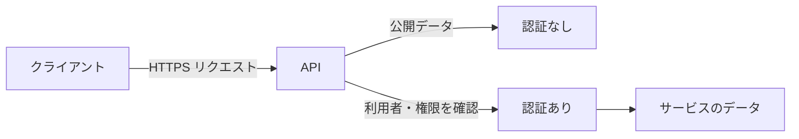
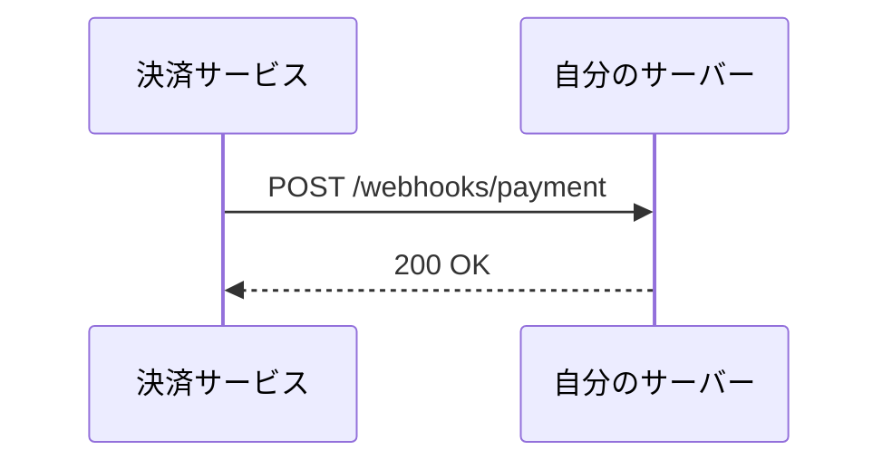

# APIの種類と認証：目的に合わせて選ぶ

「API」は一種類の仕組みではない。**何を呼び出すか**、**どこから呼び出すか**、**誰に許可するか**で形が変わる。

たとえば天気を表示するだけなら、ブラウザから公開 API を読むだけでよい。一方で、注文を確定する API には、本人確認・権限確認・重複実行への対策が必要になる。このページでは、その違いを設計の判断に使える形で整理する。



## まず区別する：Web API と API の設計方式

**Web API** は、HTTP/HTTPS を使ってネットワーク越しに呼び出す API の総称だ。`https://api.example.com/books/42` のような URL にリクエストを送り、通常は JSON を受け取る。

一方、REST・RPC・GraphQL は「Web API をどう設計し、どう呼ぶか」の流儀である。REST API は Web API の一種であり、対立する言葉ではない。

| 呼び方 | 何を表すか | 向いている場面 |
| --- | --- | --- |
| Web API | HTTP で公開される API 全般 | ブラウザ、モバイル、外部連携 |
| REST API | リソースを URL と HTTP メソッドで扱う設計 | CRUD 中心の業務アプリ |
| RPC API | 「操作」を呼び出す設計 | 処理そのものを明示したい場合 |
| GraphQL | 必要なフィールドをクエリで指定する API | 画面ごとに必要データが大きく異なる場合 |
| Webhook | 相手からイベント通知を受け取る仕組み | 決済完了、Git push などの非同期通知 |

## REST API：もの（リソース）を操作する

REST では、扱う対象を **リソース** として URL で表す。書籍なら `/books`、ID が 42 の書籍なら `/books/42` だ。「本を取得する」という動詞は URL に入れず、HTTP メソッドで表す。

```text
GET    /books/42       # 書籍を読む
POST   /books          # 書籍を作る
PATCH  /books/42       # 書籍の一部を更新する
DELETE /books/42       # 書籍を削除する
```

### 例：書籍を取得する

```bash
curl https://api.example.com/books/42
```

```json
{
  "id": 42,
  "title": "実践 Web API",
  "author": "Ada Lovelace",
  "inStock": true
}
```

REST の長所は、URL とメソッドから操作の意味を推測しやすいこと。ブラウザ・キャッシュ・監視ツールなど HTTP の既存の仕組みとも相性がよい。反面、「注文を確定する」「パスワードを再発行する」のように操作が主役の処理は、無理に名詞へ寄せると読みづらくなる。

## RPC API：操作をそのまま呼ぶ

RPC（Remote Procedure Call）は、遠隔の関数を呼ぶように API を設計する。URL に操作名を置くことが多い。

```text
POST /orders/123/cancel
POST /reports/generate
POST /users/42/send-password-reset
```

```json
POST /orders/123/cancel

{ "reason": "customer_request" }
```

キャンセル、集計、メール送信のように「状態を取得・更新する」より **業務操作を実行する** ことが中心なら、RPC は意図が明瞭になる。REST と RPC は排他的ではない。書籍の CRUD は REST、`/orders/123/cancel` だけは RPC、という混在は実務でも自然だ。

## GraphQL：画面が必要なデータだけを指定する

GraphQL は、多くの場合ひとつのエンドポイントにクエリを送る。クライアントが欲しいフィールドを選べるため、画面ごとに取得量を調整しやすい。

```graphql
query {
  book(id: 42) {
    title
    author { name }
  }
}
```

```json
{
  "data": {
    "book": {
      "title": "実践 Web API",
      "author": { "name": "Ada Lovelace" }
    }
  }
}
```

モバイルと PC で必要な項目が異なる、複数のデータを一画面で組み合わせる、といった UI では有効だ。ただし、キャッシュ・クエリの複雑さ・サーバー側の負荷制御を設計する必要がある。単純な CRUD のためだけに導入する必然性は薄い。

## Webhook：こちらから取りに行かず、相手が知らせる

REST・RPC・GraphQL は、クライアントが API を呼ぶ「プル型」だ。Webhook は逆に、イベント発生時にサービス側が登録済み URL へ HTTP リクエストを送る「プッシュ型」になる。



決済完了を数秒ごとに問い合わせるより、完了時だけ通知を受けた方が効率的だ。ただし受信側は、署名を検証し、同じイベントが再送されても壊れないように作る。Webhook の `POST` を受けただけで信用してはいけない。

## 認証なし API：公開してもよいデータだけにする

認証なし API は、呼び出した人を識別しない。例は天気、公開統計、公開カタログ、サービス稼働状態などだ。

```bash
curl "https://api.example.com/public/weather?city=tokyo"
```

便利な反面、URL を知っている誰でも呼べる。したがって「ログインしていない利用者にも見せてよいか」を基準にする。API キーを JavaScript に埋め込んだだけのものは、実質的に認証なしと考えるべきだ。ブラウザから誰でも取り出せるから。

公開 API でも無制限に使わせる必要はない。IP 単位のレート制限、CORS、キャッシュ、入力検証で濫用を抑える。

## 認証あり API：本人と権限を分けて考える

認証あり API では最低でも二つを区別する。

- **認証（authentication）**: その呼び出し元は誰か。例：ログイン済みユーザー、連携アプリ。
- **認可（authorization）**: その人は、その操作をしてよいか。例：自分の注文だけ閲覧できる、管理者だけ削除できる。

トークンが正しいだけでは足りない。`GET /users/42/orders` を受けたサーバーは、「トークンの利用者が 42 本人か、管理者か」を確認する。これを省くと、ID を変えるだけで他人の情報を読める IDOR（不適切なオブジェクト参照）になる。

### Bearer トークン

現在の Web API でよく使う形式。HTTP ヘッダーに短命のアクセストークンを載せる。

```bash
curl https://api.example.com/me \
  --header "Authorization: Bearer eyJhbGciOi..."
```

`Bearer` は「持っている者に権限がある」という意味だ。URL のクエリ文字列に入れてはいけない。URL は履歴・アクセスログ・参照元に残りやすい。

### セッション Cookie

ブラウザでのログインでは Cookie を使うことが多い。ブラウザが自動送信するので、別サイトから勝手に操作される CSRF への対策が必要になる。`Secure`、`HttpOnly`、`SameSite` を適切に設定し、状態を変える操作には CSRF トークンも検討する。

### API キー

API キーは「どのアプリケーション／契約者が呼んだか」を識別する用途に向く。サーバー間連携で使われるが、一般にエンドユーザー本人のログインを表すものではない。

```text
X-API-Key: <secret>
```

クライアントアプリへ恒久キーを同梱しない。漏えい前提になり、失効やローテーションも難しくなる。

### OAuth 2.0 / OpenID Connect

「別サービスの利用者に、限定した権限でアクセスしてもらう」なら OAuth 2.0 が使われる。OpenID Connect はその上にログイン（利用者の識別）を載せる。

例として、カレンダー連携アプリが「予定の読み取り」だけを要求し、ユーザーが同意する。アプリへパスワードを渡さず、スコープ付きトークンを発行するのが要点だ。

## 失敗したときの見方：401 と 403

| 状態 | 意味 | 例 |
| --- | --- | --- |
| `401 Unauthorized` | 身元を確認できない | トークンなし・期限切れ・署名不正 |
| `403 Forbidden` | 身元は分かるが権限がない | 一般ユーザーが管理者 API を呼ぶ |
| `404 Not Found` | 対象がない、または存在を隠す | 他人の非公開リソースを秘匿する場合もある |

名前に惑わされるな。`401` は「認証が通っていない」、`403` は「認証済みだが許可しない」と読む。

## 選び方の早見表

| 目的 | まず選ぶもの | 注意点 |
| --- | --- | --- |
| 公開情報を読む | 認証なし REST API | レート制限とキャッシュ |
| 自分のデータを操作する | 認証あり REST API | 認証と認可を両方実装 |
| 明確な業務操作を実行する | RPC 形式のエンドポイント | 再実行時の重複を防ぐ |
| 画面ごとに取得項目が大きく異なる | GraphQL | 複雑なクエリと負荷を制御 |
| 外部イベントを受け取る | Webhook | 署名検証と再送への耐性 |

設計を選ぶ前に、「誰が呼ぶか」「何を守るか」「操作を再試行したらどうなるか」を書き出す。技術名から選ぶより、この三点から選んだ方が API は破綻しにくい。
