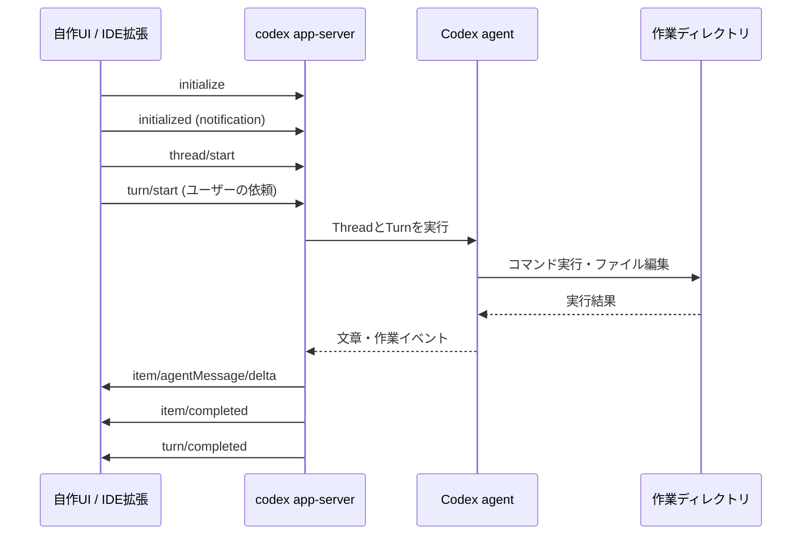

# Codex App Server：Codexを操作する画面を作る

Codex App Server は、Codex の会話、実行、承認、進捗イベントをアプリケーションから操作するためのローカル API である。Codex の VS Code 拡張のように「会話欄、作業ログ、承認ダイアログ」を持つ画面を作りたい場合に使う。

単に「リポジトリを調査して結果を返してほしい」だけなら [Codex SDK](codex-sdk.md) の方が小さい実装で済む。App Server は、途中経過を画面へ流す、会話を再開する、承認をUIとして扱う、といった**対話的なクライアント**向けである。

> **結論**
>
> - バッチ、CI、社内ボット、1回の作業依頼: Codex SDK
> - エディタ拡張、デスクトップアプリ、独自のCodex UI: App Server
> - App Server はCodex本体ではない。ローカルで動くCodexプロセスと、作った画面をつなぐプロトコルである。

## 何をつなぐのか

`codex app-server` を起動すると、クライアントは標準入出力（既定）で JSONL を送受信できる。JSONL は「1行が1個のJSON」である。HTTP APIのように、リクエストを送ってレスポンスを1回受け取れば終わり、という形ではない。Codex側からもコマンド実行、ファイル編集、文章のストリーミングといったイベントが継続して届く。



App Serverは、UIから受けたTurnをCodex agentへ渡し、agentの文章・作業イベントをUIへ戻す中継点になる。画面側は、`turn/completed` が来るまでstdoutを読み続ける。途中の `item/agentMessage/delta` を会話欄へ追記し、`item/completed` のコマンドや編集結果をアクティビティ欄へ出す、と分けると実装しやすい。

## 用語：Thread、Turn、Item

| 単位 | 意味 | UIでの見え方 |
| --- | --- | --- |
| Thread | 継続する会話・作業単位 | 1つのチャット／タスク |
| Turn | 1回の依頼から完了まで | ユーザーの送信1回 |
| Item | Turn内の入出力・作業記録 | メッセージ、コマンド、ファイル編集 |

同じThreadに次のTurnを追加すると、前の依頼と作業結果が文脈として残る。別の目的へ切り替えるときは新しいThreadを作る。途中から分岐したいときは、プロトコルの `thread/fork` を用いる。

## 接続方式と安全な選び方

| 方式 | 使いどころ | 注意 |
| --- | --- | --- |
| stdio（既定） | ローカルアプリがCodexを子プロセスとして起動する | 最初に選ぶ方式。ポートを公開しない |
| Unix socket | 同一マシン上の制御用クライアント | OSと実行環境の対応を確認する |
| WebSocket | 実験・検証 | 公式仕様ではexperimental / unsupported。プロダクション用途にしない |

App Serverは実行や承認に関わるため、ネットワークに公開するサーバーとして扱わない。特にWebSocketを `0.0.0.0` へ公開すると、接続者がローカルの作業環境を操作できる設計になり得る。まずはstd​​ioで、アプリと同じ利用者のローカル環境だけに閉じる。

## ハンズオン：最小のJSONLクライアント

この例は、Node.jsから `codex app-server` を起動し、初期化、Thread作成、1回の依頼を順に送る。外部ライブラリを使わないため、プロトコルの境界を観察できる。

### 前提条件

- Codex CLIが利用でき、認証済みである
- Node.js 18以降
- 対象ディレクトリを指定できること

```bash
mkdir codex-app-server-lab
cd codex-app-server-lab
npm init -y
```

次を `client.mjs` として保存する。

```js
import { spawn } from "node:child_process";
import { createInterface } from "node:readline";

const cwd = process.argv[2] ?? process.cwd();
const server = spawn("codex", ["app-server", "--stdio"], {
  cwd,
  stdio: ["pipe", "pipe", "inherit"],
});

let nextId = 1;
let threadId;

function send(method, params = {}) {
  const id = nextId++;
  server.stdin.write(JSON.stringify({ method, id, params }) + "\n");
  return id;
}

function notify(method, params = {}) {
  server.stdin.write(JSON.stringify({ method, params }) + "\n");
}

const lines = createInterface({ input: server.stdout });
lines.on("line", (line) => {
  const message = JSON.parse(line);

  // 依頼への応答。実際のUIではidごとにPromiseを解決する。
  if (message.id === 1) {
    notify("initialized");
    send("thread/start", { cwd });
    return;
  }

  if (message.result?.thread?.id && !threadId) {
    threadId = message.result.thread.id;
    send("turn/start", {
      threadId,
      input: [{ type: "text", text: "このリポジトリの構成を3点で説明して" }],
    });
    return;
  }

  // 通知。種類によって画面の更新先を変える。
  if (message.method === "item/agentMessage/delta") {
    process.stdout.write(message.params.delta);
  }
  if (message.method === "item/completed") {
    console.log("\n[完了した作業]", message.params.item.type);
  }
  if (message.method === "turn/completed") {
    console.log("\nTurn completed");
    server.kill();
  }
});

send("initialize", {
  clientInfo: { name: "my-codex-lab", title: "My Codex Lab", version: "0.1.0" },
});
```

実行時は、**調査だけでよいGitリポジトリ**を渡す。

```bash
node client.mjs ../sample-repository
```

このコードは学習用に応答IDを単純化している。本番では `id` とPromiseを対応付け、`error` を必ず処理する。また、作業中にUIを閉じたときは `turn/interrupt` を送る設計にする。

## 初期化を省略してはいけない

接続したら、最初に `initialize` リクエストを1回だけ送り、応答後に `initialized` 通知を送る。その前に `thread/start` を送ると `Not initialized` エラーになる。`initialize` を同じ接続で2回送るのも `Already initialized` になる。

`clientInfo` は飾りではない。どのアプリがCodexを使ったかを識別する情報として使われる。名前は安定したものにして、バージョンも送る。

```json
{"method":"initialize","id":1,"params":{"clientInfo":{"name":"review-console","title":"Review Console","version":"1.2.0"}}}
{"method":"initialized","params":{}}
```

## イベントを画面へ対応付ける

App Serverを使う価値は、最終文章だけでなく作業の進行を扱えることにある。

| 受信イベント | UIでの扱い |
| --- | --- |
| `thread/started` | チャットを作成し、Thread IDを保存する |
| `turn/started` | 送信ボタンを実行中状態にする |
| `item/agentMessage/delta` | 回答本文へ逐次追記する |
| `item/completed` | コマンド、編集、最終メッセージを時系列へ確定する |
| `turn/completed` | 使用量・終了状態を表示し、送信を再有効化する |

イベントの順番を前提に画面を壊さないことも重要である。受信が詰まるとサーバーは `-32001`（`Server overloaded; retry later.`）を返すことがある。無限再試行ではなく、指数バックオフとランダムな待ち時間を入れる。

```js
function wait(ms) {
  return new Promise((resolve) => setTimeout(resolve, ms));
}

async function retry(operation, maxAttempts = 4) {
  for (let attempt = 0; attempt < maxAttempts; attempt += 1) {
    try {
      return await operation();
    } catch (error) {
      if (error.code !== -32001 || attempt === maxAttempts - 1) throw error;
      const base = 250 * 2 ** attempt;
      await wait(base + Math.random() * 150);
    }
  }
}
```

## 承認とSandboxはUIの責務でもある

App Serverの `turn/start` では、作業ディレクトリ、Sandbox、承認方針などをTurnごとに指定できる。ここで重要なのは、アプリが「承認を省略する便利な画面」にならないことだ。

`workspace-write` は対象ワークスペースへの書込みを許すが、すべてのファイルとネットワークを無制限に許す意味ではない。`danger-full-access` はSandboxの保護を外すため、独自UIで既定値にしてはいけない。背景は [Codexのsandboxと承認](codex-sandbox.md) を参照する。

画面には少なくとも次を出す。

- 実行するコマンドと作業ディレクトリ
- ファイル変更の対象
- ネットワーク利用の有無
- 承認する操作が一度限りか、方針変更を伴うか

「承認」ボタンは、何を実行するかを見せずに通すボタンではない。利用者が境界を判断できる情報を表示して初めて意味を持つ。

## スキーマを固定して追従する

App ServerのプロトコルはCodexのバージョンとともに変わり得る。手書きの型を長期保守するより、実際に同梱されたCLIで型またはJSON Schemaを生成する。

```bash
codex app-server generate-ts --out generated/app-server
codex app-server generate-json-schema --out generated/schema
```

experimentalなメソッド・フィールドを使う必要がある場合だけ `--experimental` を付ける。クライアント側でも `initialize.params.capabilities.experimentalApi: true` が必要になる。安定版だけで実装できるなら、experimentalは使わない。

## どこまでをApp Serverに任せるか

App Serverは画面とCodexの間の会話プロトコルであり、認可基盤やジョブキューの代わりではない。複数ユーザーのサービスを作る場合は、利用者の認証、対象リポジトリの認可、監査ログ、プロセスの隔離をアプリ側で設計する。App Serverをそのままインターネットへ公開してはいけない。

参考: [Codex App Server公式ドキュメント](https://developers.openai.com/codex/app-server/)、[App Server実装のREADME](https://github.com/openai/codex/blob/main/codex-rs/app-server/README.md)
