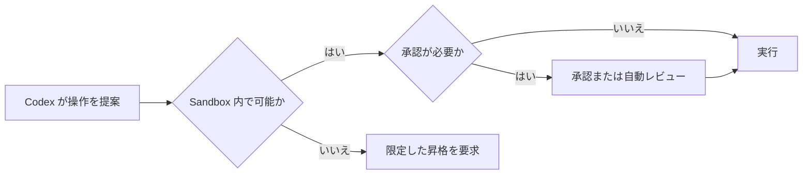

# CodexのSandboxと承認

Codex では、Sandbox と承認ポリシーが別の役割を持ちます。Sandbox はファイル・ネットワーク・実行環境の技術的な境界を定め、承認ポリシーは境界を越える操作をいつ確認するかを定めます。



この図では、承認は Sandbox を無条件に解除する操作ではありません。必要な操作だけを、理由と対象を明示して許可するための手順です。

## Sandbox モード

代表的な Sandbox モードは次の3つです。利用可能なモードは Codex の実行面や組織の管理ポリシーによって制限される場合があります。

| モード | ファイルとコマンド | 主な用途 |
| --- | --- | --- |
| `read-only` | ファイルを調査できる。編集や、ネットワークを伴う実行は承認が必要。 | 調査、レビュー、計画 |
| `workspace-write` | ワークスペース内を編集し、通常のローカルコマンドを実行できる。ネットワークは既定で無効。 | 通常の実装、テスト、文書編集 |
| `danger-full-access` | Sandbox のファイル・ネットワーク境界を外す。 | 隔離済みの信頼できる環境だけで使う |

`workspace-write` は無制限の書き込み権限ではありません。ワークスペースと明示した writable roots が対象であり、環境によっては `.git`、`.agents`、`.codex` などの管理用パスが読み取り専用に保護されます。

```toml
sandbox_mode = "workspace-write"

[sandbox_workspace_write]
writable_roots = ["/path/to/extra-output"]
network_access = false
```

この設定では、通常はワークスペース内だけを編集できます。追加した出力用ディレクトリには書き込めますが、外部ネットワークは利用できません。

## 承認ポリシー

承認ポリシーは、操作そのものの可否ではなく、実行前に確認を求める頻度を決めます。

| ポリシー | 挙動 | 向く状況 |
| --- | --- | --- |
| `untrusted` | 既知の安全な読み取り操作だけを自動実行し、それ以外は確認を求める。 | 初めて扱うリポジトリ、厳格なレビュー |
| `on-request` | Codex が必要と判断した操作で承認を求める。 | 通常の対話的な開発 |
| `never` | 承認を求めず、Sandbox の範囲内で完了を試みる。 | 自動化、明確に信頼した隔離環境 |
| granular policy | 承認カテゴリごとに許可・拒否・対話を設定する。 | 組織やチームの細かな運用 |

`never` は権限を増やしません。たとえば `workspace-write` と組み合わせた場合、Sandbox 外のファイルや無効なネットワークへ到達できるようにはなりません。反対に `danger-full-access` と `never` の組み合わせは、承認なしで広い権限を使うため、最も慎重な扱いが必要です。

## 設定の組み合わせを読む

| Sandbox | 承認 | 実際の意味 |
| --- | --- | --- |
| `read-only` | `on-request` | 読み取り中心。編集や外部通信が必要になった時点で確認する。 |
| `workspace-write` | `on-request` | ワークスペースでの編集・ローカル実行は進め、外部通信や境界外の操作で確認する。 |
| `workspace-write` | `never` | ワークスペース内で自動実行するが、Sandbox 外には出ない。自動化に適する。 |
| `danger-full-access` | `on-request` | 広い権限を持つが、必要時に対話で止める。 |
| `danger-full-access` | `never` | 広い権限と承認なしを組み合わせる。隔離済み環境以外では避ける。 |

## 承認が必要になりやすい操作

| 操作 | 典型的な理由 |
| --- | --- |
| パッケージの取得 | 外部ネットワークとローカルへの書き込みが必要になる。 |
| ワークスペース外のファイル編集 | 許可された書き込み範囲を越える。 |
| `git push` や外部 API の更新 | 外部サービスの状態を変更する。 |
| Git の内部領域の変更 | `.git` などが保護パスとして扱われる場合がある。 |
| 破壊的な削除・上書き | 復元が難しい変更を行う。 |

承認の画面では、対象、操作内容、なぜ必要かを確認します。広い権限を恒久化するより、必要な対象だけに絞った承認やルールを選ぶ方が安全です。

## 自動レビューと管理ポリシー

`approvals_reviewer = "auto_review"` を設定すると、対話的な承認要求の一部を別のレビュー処理で確認できます。これは main agent の Sandbox を広げる仕組みではなく、承認要求を誰が確認するかを変える仕組みです。

組織が管理する環境では、`requirements.toml` などの管理ポリシーがローカル設定より優先されることがあります。たとえば `danger-full-access` や `never` を選べない場合は、設定ミスではなく管理要件による制限である可能性があります。

## 実環境を調査するときの確認項目

1. 現在の `sandbox_mode` と `approval_policy` を確認する。
2. ワークスペースと writable roots を確認する。
3. 管理用パスが保護されているか確認する。
4. ネットワークが既定で無効か、承認により利用できるかを確認する。
5. `requirements.toml` や組織設定により、選択肢が制限されていないか確認する。

OS が隔離を実装する仕組みは [Sandboxの内部：OSが境界を作る仕組み](sandbox-internals.md) を参照してください。

## 参考

- [Codex manual: Approvals, sandboxing, and security](https://developers.openai.com/codex/security)
- [Codex configuration: approval policies and sandbox modes](https://developers.openai.com/codex/config-advanced#approval-policies-and-sandbox-modes)
