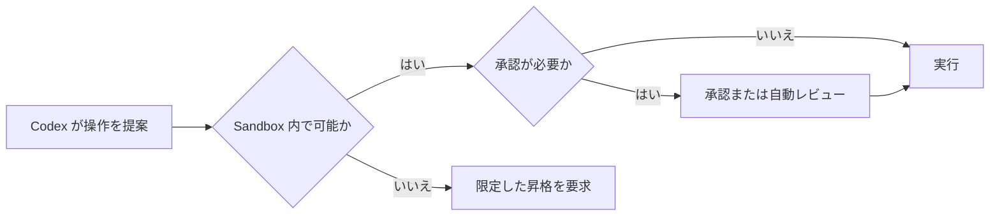
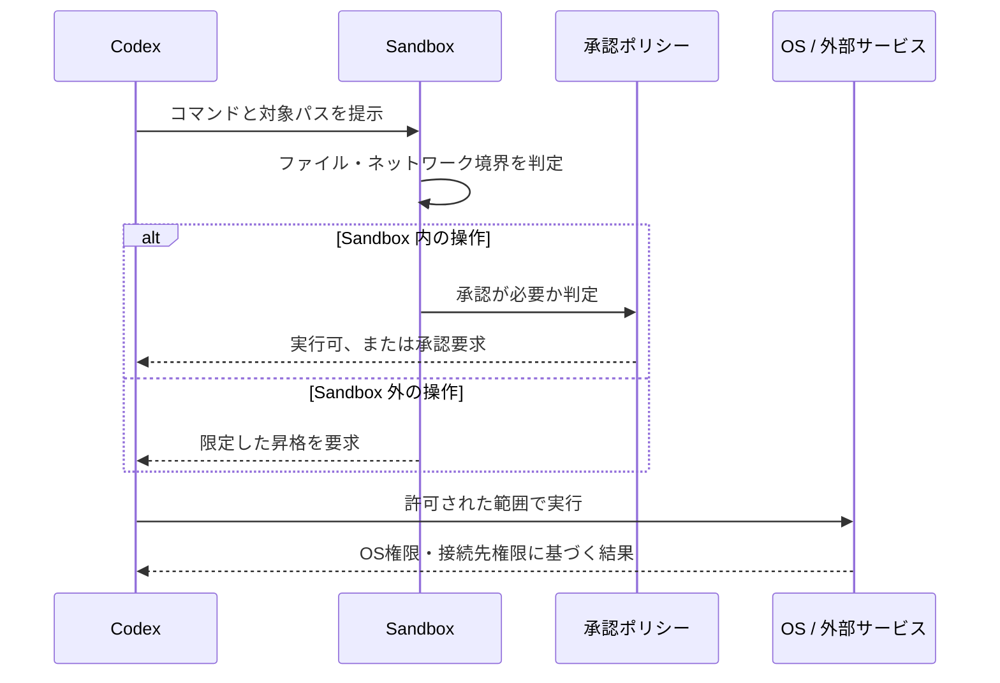

# CodexのSandboxと承認

Codex では、Sandbox と承認ポリシーが別の役割を持ちます。Sandbox はファイル・ネットワーク・実行環境の技術的な境界を定め、承認ポリシーは境界を越える操作をいつ確認するかを定めます。



この図では、承認は Sandbox を無条件に解除する操作ではありません。必要な操作だけを、理由と対象を明示して許可するための手順です。

## まず区別する：4つの境界

「Codex に何ができるか」は、Sandbox モードだけでは決まりません。少なくとも次の4つを別に確認します。

| 境界 | 決めること | `danger-full-access` にしても残るもの |
| --- | --- | --- |
| ファイルシステム | どのパスを読める・書けるか | OS の ACL、暗号化、実行ユーザーの権限 |
| ネットワーク | 外部ホストへ接続できるか | プロキシ、ファイアウォール、社内ネットワーク制御 |
| 承認 | 実行前に誰が止めて確認するか | 管理者が強制する承認・許可ポリシー |
| 外部サービス | GitHub、Slack、クラウドなどで何を変更できるか | 各サービスのログイン状態、トークン、組織権限 |

したがって、`danger-full-access` は「OS の管理者になる」「GitHub の全リポジトリを書き換えられる」という意味ではありません。Codex のローカル実行に対する Sandbox 境界を外す設定です。OS と外部サービスがもともと与えていない権限までは取得できません。

## 実行時に何が起きるか

Codex がコマンドを実行する場合、概念的には次の順で判定されます。



この流れで、Sandbox が通しても GitHub の認証がなければ `git push` は失敗します。反対に GitHub の認証があっても、Sandbox や承認が外部通信を止めていれば、通信を開始できません。

## Sandbox モード

代表的な Sandbox モードは次の3つです。利用可能なモードは Codex の実行面や組織の管理ポリシーによって制限される場合があります。

| モード | ファイルとコマンド | 主な用途 |
| --- | --- | --- |
| `read-only` | ファイルを調査できる。編集や、ネットワークを伴う実行は承認が必要。 | 調査、レビュー、計画 |
| `workspace-write` | ワークスペース内を編集し、通常のローカルコマンドを実行できる。ネットワークは既定で無効。 | 通常の実装、テスト、文書編集 |
| `danger-full-access` | Sandbox のファイル・ネットワーク境界を外す。 | 隔離済みの信頼できる環境だけで使う |

`workspace-write` は無制限の書き込み権限ではありません。ワークスペースと明示した writable roots が対象であり、環境によっては `.git`、`.agents`、`.codex` などの管理用パスが読み取り専用に保護されます。

```toml
sandbox_mode = "workspace-write"

[sandbox_workspace_write]
writable_roots = ["/path/to/extra-output"]
network_access = false
```

この設定では、通常はワークスペース内だけを編集できます。追加した出力用ディレクトリには書き込めますが、外部ネットワークは利用できません。

### `read-only` の具体的な範囲

`read-only` は、リポジトリの構造、設定、差分を読む調査に向きます。ファイルそのものは読み取り可能ですが、シェルコマンドを承認なしで実行できるかは approval policy と実行面の設定にも依存します。たとえば次のコマンドは変更を意図しない調査コマンドです。

```powershell
Get-ChildItem -Force
git status --short
Get-Content .\mkdocs.yml
```

一方、ファイル編集、依存関係の取得、ブラウザや外部アプリを伴う操作は、承認なしには実行できないか、Sandbox によって拒否されます。レビュー中に「修正もしてほしい」となった時点で、書き込み可能なモードまたは限定的な昇格が必要になります。OSレベルで何を確認して拒否されるかは [Sandboxの内部：OSが境界を作る仕組み](sandbox-internals.md) を参照してください。

### `workspace-write` の具体的な範囲

`workspace-write` は日常的な実装作業を想定したモードです。ワークスペース内であれば、ソース、設定、テスト、生成物を変更できます。

```text
許可される対象の例
  /work/my-app/src/app.ts
  /work/my-app/docs/guide.md
  /tmp/task-output/report.txt （writable root に含めた場合）

許可されない対象の例
  /home/user/.ssh/config
  /etc/hosts
  別プロジェクトの作業ディレクトリ
```

ただし、ワークスペース内でも保護パスがあります。標準的な `workspace-write` では `.git`、`.agents`、`.codex` が読み取り専用として扱われることがあります。このため、ソースの編集はできても、Git の内部状態を変える操作や一部の設定変更は承認を求める場合があります。

ネットワークが無効なら、次のような操作は実行環境の外部へ出られません。

```text
npm install             → レジストリへ接続できない
git fetch origin        → リモートへ接続できない
curl https://example.com → HTTPS 接続できない
```

これはパッケージマネージャーや Git が壊れているのではなく、通信経路が Sandbox の境界で止められている状態です。

### `danger-full-access` で外れる境界

`danger-full-access` は、Codex が生成するローカルコマンドに対するファイル・ネットワークの Sandbox 制限を外します。結果として、実行ユーザーが OS 上でアクセスできる範囲まで、コマンドの影響範囲が広がります。

| 対象 | `workspace-write` での典型的な制限 | `danger-full-access` で起き得ること |
| --- | --- | --- |
| ファイル | workspace と writable roots が中心 | 同じユーザーが読めるホーム配下、別のプロジェクト、設定ファイルへ到達し得る |
| 書き込み | 許可された作業領域に限定 | 誤った対象指定で別プロジェクトや設定を上書きし得る |
| ネットワーク | 既定で無効、または限定的な許可 | パッケージ取得、外部 API、リモート Git、任意の到達可能な宛先へ接続し得る |
| 実行プログラム | Sandbox 内で実行可能な範囲 | ローカルで実行可能なツールやインストーラをより広く起動し得る |

危険性は「Codex が意図的に悪い操作をする」ことだけではありません。誤解したパス、壊れたスクリプト、依存関係の install script、環境変数に含まれる認証情報、誤ったリモート URL が、広い到達範囲と結び付くことが問題になります。

## 具体的な事故経路

### 1. パスの取り違えによる上書き・削除

`workspace-write` なら作業領域外のパスは境界で止まりやすくなります。`danger-full-access` では、OS ユーザーが書き込める別プロジェクトや設定ディレクトリまで操作対象になり得ます。

```text
意図: /work/my-app/build だけを掃除する
誤り: 対象パスの変数が空、または親ディレクトリを指す
結果: 近くの別プロジェクトや生成物を消すおそれがある
```

この種の事故を防ぐには、削除・移動・一括置換の前に、対象パスを絶対パスで確認し、件数や差分を読み取りで確認します。

### 2. ネットワーク経由の情報流出

広いネットワークアクセスがあると、コマンドは到達可能な外部サービスへ送信できます。ログ、テスト出力、設定ファイル、環境変数に秘密情報が混ざっている場合、調査用のアップロードや外部 API 呼び出しが情報流出につながります。

```text
開発サーバーのログを外部へ送信する
  → Authorization ヘッダーやトークンが混ざっている

依存関係を追加する
  → install script がネットワーク通信やローカル操作を行う
```

外部送信が必要な場合は、送るファイル、送信先、認証情報の有無を先に確認します。ネットワークを必要なホストへ限定できる場合は、全面的な許可より限定的な許可を優先します。

### 3. 認証済み外部サービスの状態変更

ローカル Sandbox が外れても、外部サービスは別の認証・認可で保護されます。しかし、すでに認証済みの環境では、その権限の範囲で状態変更が可能になります。

```text
git push             → 書き込み権限のあるリモートブランチを更新し得る
gh issue edit        → 権限のあるリポジトリのIssueを変更し得る
クラウドCLI          → ログイン済みアカウントの資源を操作し得る
```

これは Sandbox が GitHub やクラウドの権限を与えるのではなく、既存の認証情報を使う経路を遮断しなくなるためです。外部状態を変える操作は、Sandbox モードにかかわらず対象リポジトリ、ブランチ、アカウントを明示します。

### 4. `danger-full-access` と `never` の組み合わせ

`approval_policy = "never"` は、確認画面を出さない設定です。これ単独では権限を増やしません。しかし `danger-full-access` と組み合わせると、広い到達範囲のコマンドを対話で止める機会も減ります。

```toml
sandbox_mode = "danger-full-access"
approval_policy = "never"
```

この組み合わせは、使い捨ての隔離 VM、専用 CI runner、秘密情報を置かない検証環境など、影響範囲を別の層で閉じ込めた場合に限ります。個人の普段使いの端末や、複数のリポジトリ・資格情報を持つ開発環境には適しません。

## `danger-full-access` でもできないこと

誤解を避けるため、Sandbox を外しても次の制約は残ります。

- OS が実行ユーザーに与えていない読み書き権限や管理者権限
- BitLocker、FileVault、鍵管理サービスなどで保護された秘密情報
- GitHub、Slack、クラウドなどが要求するログイン、トークン、組織権限
- ファイアウォール、VPN、プロキシ、組織のネットワーク制御
- `requirements.toml` など、管理者が強制する Codex の許可ポリシー

「フルアクセス」は Codex の Sandbox に対する表現であり、マシンや組織のすべての防御を無効にする表現ではありません。

## 承認ポリシー

承認ポリシーは、操作そのものの可否ではなく、実行前に確認を求める頻度を決めます。

| ポリシー | 挙動 | 向く状況 |
| --- | --- | --- |
| `untrusted` | 既知の安全な読み取り操作だけを自動実行し、それ以外は確認を求める。 | 初めて扱うリポジトリ、厳格なレビュー |
| `on-request` | Codex が必要と判断した操作で承認を求める。 | 通常の対話的な開発 |
| `never` | 承認を求めず、Sandbox の範囲内で完了を試みる。 | 自動化、明確に信頼した隔離環境 |
| granular policy | 承認カテゴリごとに許可・拒否・対話を設定する。 | 組織やチームの細かな運用 |

`never` は権限を増やしません。たとえば `workspace-write` と組み合わせた場合、Sandbox 外のファイルや無効なネットワークへ到達できるようにはなりません。反対に `danger-full-access` と `never` の組み合わせは、承認なしで広い権限を使うため、最も慎重な扱いが必要です。

## 設定の組み合わせを読む

| Sandbox | 承認 | 実際の意味 |
| --- | --- | --- |
| `read-only` | `on-request` | 読み取り中心。編集や外部通信が必要になった時点で確認する。 |
| `workspace-write` | `on-request` | ワークスペースでの編集・ローカル実行は進め、外部通信や境界外の操作で確認する。 |
| `workspace-write` | `never` | ワークスペース内で自動実行するが、Sandbox 外には出ない。自動化に適する。 |
| `danger-full-access` | `on-request` | 広い権限を持つが、必要時に対話で止める。 |
| `danger-full-access` | `never` | 広い権限と承認なしを組み合わせる。隔離済み環境以外では避ける。 |

## 承認が必要になりやすい操作

| 操作 | 典型的な理由 |
| --- | --- |
| パッケージの取得 | 外部ネットワークとローカルへの書き込みが必要になる。 |
| ワークスペース外のファイル編集 | 許可された書き込み範囲を越える。 |
| `git push` や外部 API の更新 | 外部サービスの状態を変更する。 |
| Git の内部領域の変更 | `.git` などが保護パスとして扱われる場合がある。 |
| 破壊的な削除・上書き | 復元が難しい変更を行う。 |

承認の画面では、対象、操作内容、なぜ必要かを確認します。広い権限を恒久化するより、必要な対象だけに絞った承認やルールを選ぶ方が安全です。

## 推奨する使い分け

| 作業 | 推奨設定 | 理由 |
| --- | --- | --- |
| コードレビュー、調査 | `read-only` + `on-request` | 変更を防ぎ、必要な例外だけを確認できる |
| 通常の実装とテスト | `workspace-write` + `on-request` | 作業領域の変更を進めつつ、外部通信や境界外操作で停止できる |
| 使い捨てCIでの自動生成 | `workspace-write` + `never` | 到達範囲を保ったまま、対話を省ける |
| 完全に隔離した検証VM | 必要性を確認した上で `danger-full-access` | 広い権限の影響をホストへ持ち込まない |

まず `workspace-write` で不足する操作を具体的に特定します。その上で writable roots、ネットワーク許可、承認ルールを狭く追加し、それでも満たせない場合にだけ `danger-full-access` を検討します。

## 自動レビューと管理ポリシー

`approvals_reviewer = "auto_review"` を設定すると、対話的な承認要求の一部を別のレビュー処理で確認できます。これは main agent の Sandbox を広げる仕組みではなく、承認要求を誰が確認するかを変える仕組みです。

組織が管理する環境では、`requirements.toml` などの管理ポリシーがローカル設定より優先されることがあります。たとえば `danger-full-access` や `never` を選べない場合は、設定ミスではなく管理要件による制限である可能性があります。

## 実環境を調査するときの確認項目

1. 現在の `sandbox_mode` と `approval_policy` を確認する。
2. ワークスペースと writable roots を確認する。
3. 管理用パスが保護されているか確認する。
4. ネットワークが既定で無効か、承認により利用できるかを確認する。
5. `requirements.toml` や組織設定により、選択肢が制限されていないか確認する。

OS が隔離を実装する仕組みは [Sandboxの内部：OSが境界を作る仕組み](sandbox-internals.md) を参照してください。

## 参考

- [Codex manual: Approvals, sandboxing, and security](https://developers.openai.com/codex/security)
- [Codex configuration: approval policies and sandbox modes](https://developers.openai.com/codex/config-advanced#approval-policies-and-sandbox-modes)
