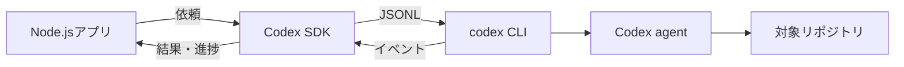

# Codex SDK：コード作業をアプリへ組み込む

Codex SDKは、TypeScriptのプログラムからCodexへ作業を依頼するためのSDKである。社内ツール、CI補助、レビュー自動化、開発者向けボットなどで「このリポジトリを調査して」「修正案をJSONで返して」と実行したいときに向く。

重要なのは、SDKが単にOpenAIのHTTP APIを包んだものではない点である。`@openai/codex-sdk` は `@openai/codex` のCLIを子プロセスとして起動し、stdin/stdout上のJSONLイベントを扱いやすいThread APIへ包む。したがって、SDKを導入する環境にはNode.jsだけでなく、Codex CLIを実行できる環境と認証情報が必要になる。



この構造から、SDKは「独自のチャットUIを作る」よりも「アプリの処理フローにCodexの1作業を組み込む」用途に適する。UIや承認フローを細かく制御したい場合は [App Server](codex-app-server.md) を使う。

## 使える用途

| 用途 | 依頼例 | SDKが合う理由 |
| --- | --- | --- |
| PR前のセルフレビュー | 「差分を読み、破壊的変更をJSONで列挙する」 | 構造化出力を後続処理へ渡せる |
| Issueの一次分類 | 「再現手順・影響範囲・不足情報を抽出する」 | バッチとして複数件を順に処理できる |
| リポジトリ調査ボット | 「認証処理の入口を説明する」 | 指定した作業ディレクトリで調査できる |
| 開発支援コマンド | 「テスト失敗を調査し、修正案まで提示する」 | ストリームをCLIやWeb UIへ転送できる |

一方、Webhookを受けただけで無制限にリポジトリを書き換える用途には、そのまま使わない。入力の認可、対象パス、Sandbox、承認、変更のレビューをアプリ側で明示的に設計する必要がある。

## ハンズオン：調査結果をJSONで返すコマンド

最初の題材は、指定リポジトリを読み、状態を決まったJSONで返す小さなコマンドである。出力形式を固定すると、後でGitHub IssueやSlack通知などへ安全に接続しやすい。

### 1. プロジェクトを作る

```bash
mkdir codex-sdk-lab
cd codex-sdk-lab
npm init -y
npm install @openai/codex-sdk
```

Node.js 18以降が必要である。Codex CLIの認証は、利用する環境のCodex設定またはSDKへ渡す認証情報で行う。秘密鍵やトークンをソースコード、ログ、Gitへ書かない。

### 2. まずは1回だけ実行する

`inspect.mjs` を作成する。

```js
import { Codex } from "@openai/codex-sdk";

const workingDirectory = process.argv[2];
if (!workingDirectory) {
  throw new Error("使い方: node inspect.mjs /path/to/repository");
}

const codex = new Codex();
const thread = codex.startThread({ workingDirectory });

const turn = await thread.run([
  {
    type: "text",
    text: [
      "このリポジトリを変更せずに調査する。",
      "主要な構成、テストの実行方法、注意すべき設定を日本語で説明して。",
      "不明な点は推測せず、不明と書く。",
    ].join("\n"),
  },
]);

console.log(turn.finalResponse);
```

```bash
node inspect.mjs ../sample-repository
```

`run()` はTurnが完了するまでイベントを内部で蓄積し、最後に `finalResponse` と `items` を返す。完成した文章だけが必要なバッチでは、これが最も単純である。

## 同じThreadを使うと会話が続く

調査の直後に「ではテスト失敗の原因を絞って」と依頼する場合、新しいThreadを作らず同じインスタンスへ `run()` をもう一度呼ぶ。前の会話と作業が文脈になる。

```js
const first = await thread.run("まずテスト構成を調査して");
console.log(first.finalResponse);

const second = await thread.run("次に、失敗しやすいテストを1つ選び、原因候補を説明して");
console.log(second.finalResponse);
```

プロセスをまたいで再開する場合、Thread IDを保存し、`resumeThread()` を使う。保存先のセッション情報は利用者のCodex環境にあるため、別ホストへ勝手に移植できる前提にはしない。

```js
const savedThreadId = process.env.CODEX_THREAD_ID;
if (!savedThreadId) throw new Error("CODEX_THREAD_ID が必要です");

const thread = codex.resumeThread(savedThreadId);
const turn = await thread.run("前回の調査を踏まえ、次の確認項目を提案して");
console.log(turn.finalResponse);
```

## ハンズオン：レビュー結果を構造化出力にする

文章をそのまま機械処理すると、「問題なし」「問題なしです」のような表現差で壊れる。後段のプログラムが読む結果にはJSON Schemaを使う。

```js
import { Codex } from "@openai/codex-sdk";

const schema = {
  type: "object",
  properties: {
    summary: { type: "string" },
    risk: { type: "string", enum: ["low", "medium", "high"] },
    findings: {
      type: "array",
      items: {
        type: "object",
        properties: {
          file: { type: "string" },
          concern: { type: "string" },
          recommendation: { type: "string" },
        },
        required: ["file", "concern", "recommendation"],
        additionalProperties: false,
      },
    },
  },
  required: ["summary", "risk", "findings"],
  additionalProperties: false,
};

const codex = new Codex();
const thread = codex.startThread({ workingDirectory: process.argv[2] });
const turn = await thread.run(
  "現在の差分をレビューする。根拠がある項目だけを返し、ファイルを変更しない。",
  { outputSchema: schema },
);

const review = JSON.parse(turn.finalResponse);
for (const finding of review.findings) {
  console.log(`${finding.file}: ${finding.concern}`);
}
```

Schemaはモデルに「この形式で答える」よう制約するためのものであり、入力値を信用してよいという意味ではない。`JSON.parse` の例外、空配列、利用者が読めないファイル名を処理し、外部サービスへ投稿する前にアプリ側でも検証する。

## 進捗を見せるなら `runStreamed()`

作業が数十秒以上かかると、無反応に見える。`runStreamed()` は非同期ジェネレータを返すので、Codexの作業中イベントを表示できる。

```js
const { events } = await thread.runStreamed(
  "テスト失敗を調査し、修正を行う前に作業計画を示して",
);

for await (const event of events) {
  switch (event.type) {
    case "item.completed":
      console.log("完了:", event.item.type);
      break;
    case "turn.completed":
      console.log("トークン使用量:", event.usage);
      break;
  }
}
```

Webアプリなら、イベントをServer-Sent EventsやWebSocketでブラウザへ中継する。SDKプロセスのstdoutをそのままHTTPレスポンスへ流すのではなく、許可するイベント種類に変換し、認証済みの依頼IDと対応付ける。

## 作業ディレクトリは明示する

SDKは既定でNodeプロセスのカレントディレクトリを使う。サービスやワーカーでは起動場所が意図せず変わりやすいため、`workingDirectory` を必ず明示する。

```js
const thread = codex.startThread({
  workingDirectory: "/srv/workspaces/payment-api",
});
```

通常、Codexは作業ディレクトリがGitリポジトリであることを要求する。学習用の空ディレクトリなどでだけ `skipGitRepoCheck: true` を使えるが、実務では対象をGit管理し、差分を確認できる状態にする方が安全である。

```js
const thread = codex.startThread({
  workingDirectory: "/tmp/codex-lab",
  skipGitRepoCheck: true,
});
```

## 環境変数と設定を絞る

SDKは既定でNodeプロセスの環境変数を引き継ぐ。Webサーバーのように多くの秘密情報を持つプロセスで、何も考えずに起動すると、Codex CLIにも不要な環境変数が渡る。`env` を渡して必要最小限にする。

```js
const codex = new Codex({
  env: {
    PATH: process.env.PATH ?? "",
    // 認証情報はデプロイ環境のシークレットから渡す。値をログに出さない。
    CODEX_API_KEY: process.env.CODEX_API_KEY ?? "",
  },
});
```

設定上書きは `config` で渡せる。SDKはネストしたオブジェクトをCodex CLIの `--config key=value` に変換する。ただし、Sandboxを緩める設定をアプリの既定にするのは危険である。ネットワークアクセスや書込み権限は、用途ごとに最小化し、[Codexのsandboxと承認](codex-sandbox.md) と同じ基準で扱う。

## 実装時のチェックリスト

- 対象リポジトリを利用者・組織ごとに認可しているか
- `workingDirectory` を固定し、利用者入力をそのままパスにしていないか
- 調査だけの処理に書込み可能な設定を与えていないか
- `finalResponse` を外部投稿する前に、JSON Schemaとアプリ側の検証を通しているか
- 進捗、失敗、タイムアウトを依頼IDごとに記録しているか
- 秘密情報をプロンプト、ログ、イベント中継へ混ぜていないか

Codex SDKは便利な自動化の入口だが、実行権限を持つエージェントをアプリへ組み込むことでもある。SDKの呼び出し1行の外側に、対象範囲・承認・監査の設計を置く。

参考: [Codex SDK公式README](https://github.com/openai/codex/blob/main/sdk/typescript/README.md)、[Codex App Server](codex-app-server.md)
