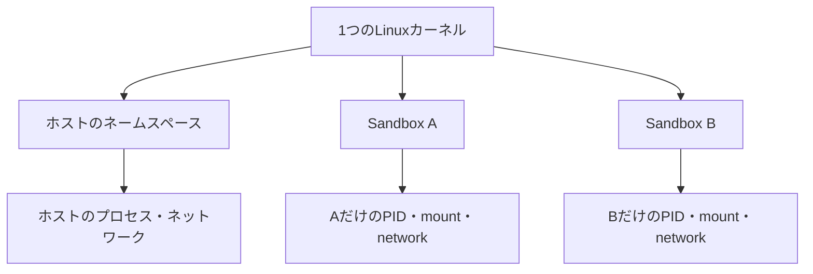

# ネームスペース：プロセスごとに見える世界を分ける

Linux の namespace（ネームスペース）は、同じカーネル上で動くプロセスに対して、資源の見え方を分ける機構です。コンテナや Sandbox がホストと異なるプロセス一覧、ネットワーク、マウントを見せられる理由の一部は、この機構にあります。

## 「同じマシンで別の世界を見る」とは何か

ホストには多数のプロセス、ネットワーク設定、ファイルシステムがあります。ネームスペースに参加したプロセスは、そのうち自分に割り当てられた範囲だけを基準として扱います。



カーネルは共有されていますが、プロセスから見える識別子と資源の範囲は分けられます。ネームスペースは仮想マシンのように別カーネルを起動する仕組みではありません。

## 主な種類

| 種類 | 分ける対象 | Sandbox での意味 |
| --- | --- | --- |
| mount | マウントポイントとファイルシステムの見え方 | ホストのディレクトリを隠し、workspace だけを見せる |
| PID | プロセス ID の空間 | 内側のプロセス一覧をホストから分離する |
| network | NIC、IP、ルーティング、ポート | 通信経路や到達先を分ける |
| user | UID/GID と権限の対応 | 内側の root をホストの非特権ユーザーへ対応付ける |
| IPC | 共有メモリ、メッセージキュー、セマフォ | 別環境との IPC を分離する |
| UTS | ホスト名とドメイン名 | 環境ごとに異なるホスト名を見せる |
| cgroup | cgroup の見え方 | 資源制限を環境内から観測しやすくする |

## mount namespace：見えるパスを分ける

mount namespace は、どのディレクトリがどこへマウントされているかを分けます。

```text
ホスト                       Sandbox 内
/home/user/project           /workspace
/etc                         見えない、または読み取り専用の別内容
/tmp                         専用の一時領域
```

ここで注意すべき点は、パスを隠すだけでは書き込みを禁止しないことです。書き込み可否は、マウントを読み取り専用にする設定、ファイル権限、MAC ポリシーなどと組み合わせて決まります。

## PID namespace：プロセスの親子関係を分ける

PID namespace では、Sandbox 内の最初のプロセスが PID 1 として見えます。内側から `ps` を実行すると、そのネームスペースに属するプロセスだけが表示されます。

```text
ホスト:       PID 4821 = sandbox の開始プロセス
Sandbox 内:   PID 1    = 同じ開始プロセス
```

PID 1 は子プロセスの終了を回収する役割も持つため、コンテナ内ではシグナル処理と zombie プロセスの回収を意識する必要があります。

## network namespace：通信を別のネットワークに置く

network namespace には、独自のネットワークインターフェース、IP アドレス、ルーティングテーブル、ポート空間を持たせられます。

```text
Sandbox 内の localhost:3000
  → Sandbox の loopback にだけ届く
  → ホストの localhost:3000 と同じとは限らない
```

この分離だけでインターネット接続が禁止されるわけではありません。外部へ出す veth、NAT、ルーティング、ファイアウォールを設定した場合にだけ通信できます。

## user namespace：内側の root とホストの root を分ける

user namespace は UID/GID を対応付けます。Sandbox 内で UID 0（root）に見えるプロセスを、ホストでは非特権 UID として扱えます。

```text
Sandbox 内 UID 0  → ホスト UID 1000
```

これにより、内側で root のように扱う操作があっても、ホスト全体の root 権限へ直結しにくくなります。ただし、マッピングや追加 capability の設定を誤ると境界が弱くなるため、単独で安全性を保証するものではありません。

## 作成と確認の例

Linux では `unshare` を使って、現在のプロセスを新しいネームスペースで実行できます。

```bash
unshare --mount --pid --fork --uts --ipc --net bash
```

このコマンドは実行環境の権限や設定によって失敗することがあります。特に `--net` は、ネットワークを使用可能にする設定とは別に、ネームスペース作成の権限が必要です。

既存プロセスが参加しているネームスペースは、Linux では次のように確認できます。

```bash
lsns
readlink /proc/$$/ns/mnt
readlink /proc/$$/ns/net
```

## ネームスペースだけでは足りない

ネームスペースは「何が見えるか」を分けますが、資源消費、システムコール、通信先の許可までは単独で制御しません。Sandbox を設計・調査するときは、ネームスペース、ファイル権限、seccomp、cgroups、ネットワーク方針を別々に確認します。

これらの層の全体像は [Sandboxの内部：OSが境界を作る仕組み](sandbox-internals.md) を参照してください。
