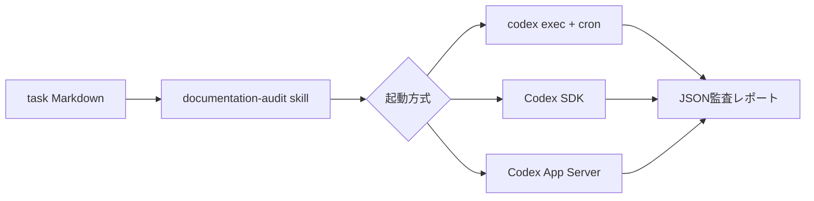

# Codex 自動実行の3方式を比較する

## 検証タスク

検証用リポジトリ [codex-automation-lab](https://github.com/nyufufu777/codex-automation-lab) に、運用資料の監査タスクを置いた。`task/` のMarkdownをすべて読み、スケジュール矛盾、存在しないローカルリンク、トークンをログへ出す危険、復旧手順と責任者の曖昧さを、根拠の行番号付きJSONとして返す。

出力形式はJSON Schemaで固定した。`.agents/skills/documentation-audit/SKILL.md` をrepo固有skillとして置き、証拠を伴わない指摘を出さない、入力資料を変更しない、という反復可能な監査手順をCodexへ与えている。

## 方式の比較

| 方式 | 実装 | 向いている用途 | 注意点 |
| --- | --- | --- | --- |
| `codex exec` + cron | `scripts/run-exec.sh` とcrontab | 定型の夜間監査、最終成果物だけを受け取る処理 | 認証、PATH、作業ディレクトリを明示し、登録解除を忘れない |
| Codex SDK | `scripts/run-sdk.mjs` | アプリの制御フローへ組み込み、Schema出力を利用する処理 | Node依存関係とCLI認証のライフサイクルを管理する |
| Codex App Server | `scripts/run-app-server.mjs` | スレッド、ターン、進捗イベント、承認を持つ独自クライアント | JSON-RPC初期化、イベント、接続を自前で管理する。単発定期実行には重い |

入力・skill・出力Schemaを共通にしている。差はプロンプトではなく、起動・状態管理・結果の取り込み方に現れる。

## 実行結果

2026-07-26、WSL Ubuntu上のCodex CLI 0.105.0で同じ監査を3方式から実行した。最初は保存済み認証の更新に失敗したが、`codex login` 後には実行できた。さらにWSLの既定モデル `gpt-5.3-codex` はChatGPT認証で非対応だったため、各スクリプトで `gpt-5.4` を明示し、`CODEX_MODEL` で上書きできるようにした。

| 方式 | 実測結果 | 返した主な指摘 |
| --- | --- | --- |
| `codex exec` | 完走。repo固有skillを読み、JSON Schemaの検証も通過 | 実行時刻の矛盾、トークンをログへ出す危険、復旧手順の欠落、責任者の曖昧さ（4件） |
| Codex SDK | 完走。`Thread.run()` で構造化JSONを取得 | `exec` と同じ4分類の指摘（4件） |
| Codex App Server | 完走。JSON-RPCで `initialize`、`thread/start`、`turn/start`、イベント受信を確認 | 上記に加え、休日・夜間の対応体制不足を指摘（5件） |

3方式すべてで、入力ファイルを変更せず、行番号を根拠とする優先度付きJSONを生成した。App Serverの指摘数が一件多いのは、出力の揺れを示している。方式を変えても完全に同じ文章や件数になることは保証されないため、自動処理ではSchemaで形を固定し、人間が判断する閾値や後続処理も明示する必要がある。

cronは `verify-cron-once.sh` で一時登録し、実際にCodex監査が起動してJSONを生成するところまで確認した。trapによる解除後の `crontab -l` は空で、定時登録は残していない。

## 結論

定時の単発監査なら、まず `codex exec` + cron を選ぶ。最終メッセージをファイルへ出し、JSON Schemaで後続処理を安定させられるからよ。今回の用途ではSDKとApp Serverも動いたが、実行制御と依存関係が増えるだけで、得られる価値は小さい。状態の再利用や複数段階の処理が必要ならSDKへ上げる。App Serverは会話履歴や進捗表示、承認フローを持つ独自クライアント向けで、cronの代替として導入するものではない。

所感としては、認証・モデル・常駐する実行環境の3点を先に固定しない自動化は脆い。今回もタスク本体ではなく、失効した認証と非対応モデルが最初の障害だった。ユーザー設定にある利用しないMCPサーバーの起動失敗はログを汚したが、監査自体は継続した。定期ジョブには専用プロファイルを用意し、必要なskillだけを有効にして、認証とモデルを明示する構成が扱いやすい。

共有ジョブやCIでは信頼済み実行環境に限定し、認証情報をジョブ全体の環境変数やリポジトリへ置かない。必要な権限は読み取り専用のままにし、入力資料を自動修正させない。
