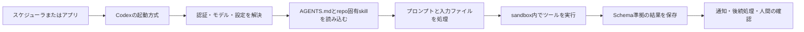
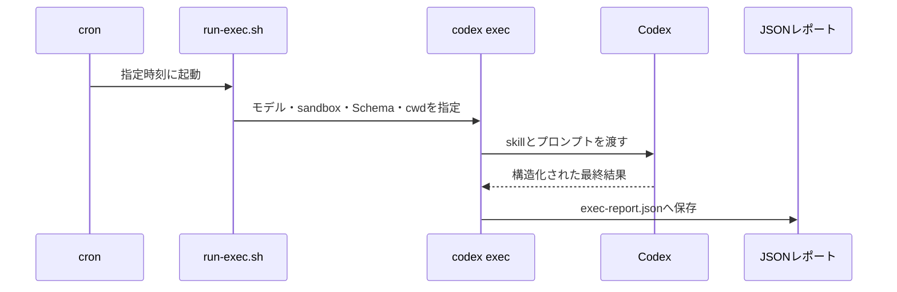
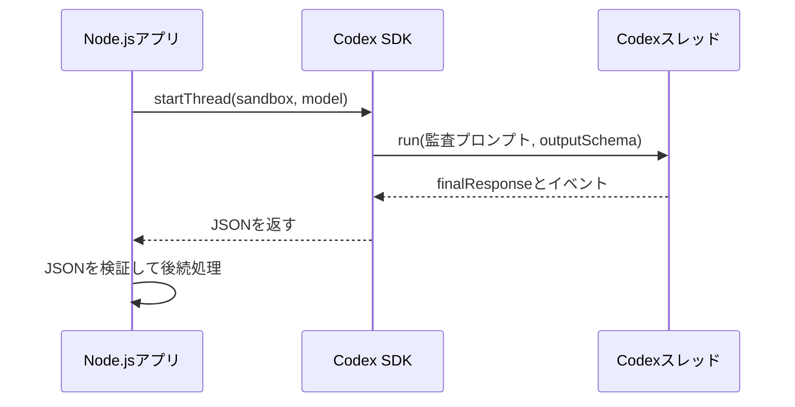
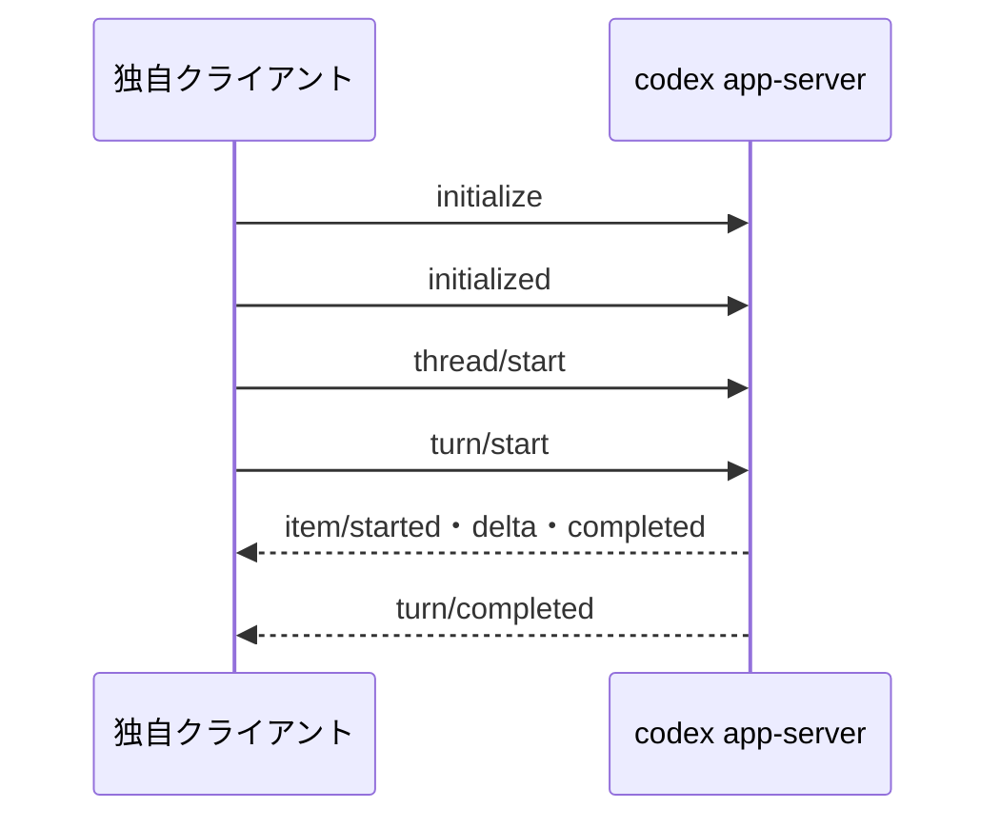

# Codex を定期実行・組み込み実行する

## 何を選べばよいか

Codexを自動で動かす入口は3つある。毎晩のドキュメント監査のように、決まった入力からファイルを1つ生成するだけなら `codex exec` を選ぶ。アプリケーション内でスレッドを継続したり、結果を次の処理へ渡したりするなら Codex SDK を選ぶ。独自の画面で進捗、承認、会話履歴を表示するなら Codex App Server を選ぶ。

| 方式 | 実行を開始する主体 | 結果の受け取り方 | 適した場面 | 避ける場面 |
| --- | --- | --- | --- | --- |
| `codex exec` + cron | cronなどのスケジューラがCLIを起動 | 標準出力または出力ファイル | 定期監査、日報、リリースノート | 会話をまたぐ処理、画面への逐次表示 |
| Codex SDK | Node.jsやPythonアプリケーション | `finalResponse`、イベント、スレッドID | ワークフローの一工程、結果を後続処理へ渡す | 単発ジョブだけのためにアプリ層を増やす場合 |
| Codex App Server | 自作クライアントがJSON-RPCで操作 | `turn`・`item`の通知ストリーム | チャット画面、進捗表示、承認付きツール実行 | cronの代替としての単純な定時実行 |

## 共通の動作フロー

3方式とも、Codexが作業を始める前に、実行環境・プロジェクト指示・skill・プロンプト・sandboxを解決する。skillは作業手順、`AGENTS.md` はリポジトリ規約、プロンプトは今回だけの依頼を担う。混同すると、再現性が落ちる。



重要なのは、Codexの出力をそのまま次の自動処理へ流さないこと。JSON Schemaで出力の形を固定し、成功・失敗・要確認のどれを後続処理が受け取るかを決める。

## 実践例: 運用ドキュメントの監査

検証用リポジトリ [codex-automation-lab](https://github.com/nyufufu777/codex-automation-lab) では、`task/` 以下のMarkdownを読み、運用上の矛盾・リンク切れ・秘密情報の扱い・復旧手順・責任者の曖昧さをJSONで返す。入力を変更させず、根拠としてファイルと行番号を必須にしている。

repo固有skill `.agents/skills/documentation-audit/SKILL.md` は、全資料を読むこと、事実には行番号を付けること、優先度を付けることを定義する。つまり、毎回長いプロンプトへ監査基準を複製しない。

実行例は次のとおり。

```bash
cd /path/to/codex-automation-lab
bash scripts/run-exec.sh
```

このスクリプトは読み取り専用sandbox、`documentation-audit` skill、JSON Schema、出力先を指定する。ChatGPT認証では利用可能なモデルを明示する必要があるため、既定では `gpt-5.4` を選ぶ。利用可能な別モデルを使う場合だけ `CODEX_MODEL` で上書きする。

```bash
CODEX_MODEL=gpt-5.4 bash scripts/run-exec.sh
```

## `codex exec` をcronで動かす場合

cronは「時刻にシェルコマンドを起動するだけ」で、認証も作業ディレクトリもskillも面倒を見ない。対話ターミナルでは動くのにcronでは失敗する原因は、ほぼここにある。



定期登録の前に、同じスクリプトを手動で一回実行する。次に、一回限りのcron登録で出力とログを確認し、解除する。この順番なら、毎時や毎日の失敗ジョブを残さない。

```bash
# 一度だけ登録・実行確認・解除を行う
bash scripts/verify-cron-once.sh

# 中断した場合も明示的に解除する
bash scripts/remove-cron.sh
```

WSLでcronを使うなら、WSLディストリビューション自体が実行時刻まで起動し続ける構成が必要になる。PCのスリープ、WSLの停止、ログアウトをまたいで確実に起動したい処理では、常時稼働するLinuxホスト、Windowsタスクスケジューラ、またはCIのスケジュール実行を検討する。

## SDKとApp Serverの途中処理の違い

### Codex SDK

SDKではアプリケーションがスレッドを作り、`run()` の戻り値として最終結果を受け取る。スレッドIDを保存すれば、次回に前回の文脈を引き継げる。たとえば「監査する」「高優先度だけチケット化する」「修正案を作る」のような段階的な処理をアプリ側で制御できる。



SDKは「Codexの結果をプログラムの分岐に使う」場合に有用である。単なる夜間ジョブなら、SDKの依存関係やプロセス管理を増やす利益は小さい。

### Codex App Server

App ServerはクライアントとCodexの間にJSON-RPCの接続を置く。クライアントは最初に `initialize` し、`thread/start` で会話を作り、`turn/start` で依頼を送る。その後、エージェントメッセージ、コマンド実行、ファイル変更、ターン完了などの通知を受け取る。



App Serverの価値は、最終回答だけでなく途中経過をUIへ出せることにある。承認ボタン、キャンセル、会話履歴、差分表示が必要なら有力だが、接続の初期化、イベント処理、再接続、認可までクライアントが責任を持つ。

## 動作確認で固定する項目

次の順に確認すると、障害の場所を切り分けやすい。

1. `codex login` 後に、読み取り専用の短い `codex exec` が成功するか。
2. 実行するモデルを明示し、アカウントで利用可能か確認する。
3. skillが検出され、`AGENTS.md` の制約が効くか確認する。
4. 手動実行でJSON Schemaに合う結果が出るか確認する。
5. 一回限りのスケジュールで、同じ出力先とログに結果が残るか確認する。
6. 定期登録を解除した後、`crontab -l` などで残骸がないか確認する。

今回の監査では、3方式とも入力を変更せず、行番号付きのJSONを返した。`exec` とSDKは4件、App Serverは5件の指摘を返した。これは方式ごとに出力の細部が揺れることを示す。出力Schemaは形を安定させるが、内容を完全に同一にするものではない。

## 運用上の制約

- 認証は定期実行で最も先に壊れやすい。失効・更新失敗をログで識別できるようにする。
- モデル名をユーザー設定へ任せると、対話環境と定期ジョブで挙動が変わる。ジョブ側で明示する。
- 不要なMCPサーバーが起動すると、認証失敗のログが混ざる。定期ジョブ用には必要最小限の設定を使う。
- プロンプトへIssue本文、PR本文、外部Webページなどの信頼できない入力をそのまま渡さない。
- 書き込みが不要な監査は `read-only` sandboxで実行する。修正タスクへ広げる場合も、書き込み範囲を狭くする。
- APIキーやアクセストークンをリポジトリ、プロンプト、生成レポート、ジョブログへ出さない。

定期処理の目的が「結果を作ること」だけなら `codex exec` で十分である。途中経過を使ったアプリケーション制御が必要になった時点でSDKへ進み、ユーザー向けの対話体験を作る必要が出た時点でApp Serverを選ぶ。この順序なら、必要以上の仕組みを抱えずに済む。
