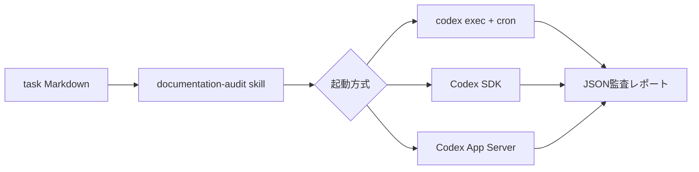

# Codex 自動実行の3方式を比較する

## 検証タスク

検証用リポジトリ [codex-automation-lab](https://github.com/nyufufu777/codex-automation-lab) に、運用資料の監査タスクを置いた。`task/` のMarkdownをすべて読み、スケジュール矛盾、存在しないローカルリンク、トークンをログへ出す危険、復旧手順と責任者の曖昧さを、根拠の行番号付きJSONとして返す。

出力形式はJSON Schemaで固定した。`.agents/skills/documentation-audit/SKILL.md` をrepo固有skillとして置き、証拠を伴わない指摘を出さない、入力資料を変更しない、という反復可能な監査手順をCodexへ与えている。

## 方式の比較

| 方式 | 実装 | 向いている用途 | 注意点 |
| --- | --- | --- | --- |
| `codex exec` + cron | `scripts/run-exec.sh` とcrontab | 定型の夜間監査、最終成果物だけを受け取る処理 | 認証、PATH、作業ディレクトリを明示し、登録解除を忘れない |
| Codex SDK | `scripts/run-sdk.mjs` | アプリの制御フローへ組み込み、Schema出力を利用する処理 | Node依存関係とCLI認証のライフサイクルを管理する |
| Codex App Server | `scripts/run-app-server.mjs` | スレッド、ターン、進捗イベント、承認を持つ独自クライアント | JSON-RPC初期化、イベント、接続を自前で管理する。単発定期実行には重い |

入力・skill・出力Schemaを共通にしている。差はプロンプトではなく、起動・状態管理・結果の取り込み方に現れる。

## 実行結果

2026-07-26、WSL Ubuntu上のCodex CLI 0.105.0で3経路を起動した。`codex exec`、SDK、App Serverはいずれも起動までは到達したが、WSL側の保存済みrefresh tokenがすでに使用済みで、アクセストークンを更新できず401で停止した。このため監査JSONは生成されなかった。

SDKでは `Thread.run()` が認証エラーを送出した。App Serverもthread/turn処理に進む前に同じ認証エラーになった。一方、App Server用JSON Schemaの生成は成功し、`thread/start`、`turn/start`、イベント形式をそのCLIバージョンに合わせて確認できた。

cronは一時的にcrontabへ登録し、`scripts/remove-cron.sh`で削除した。この検証環境のWSLはシェル終了とともにcronサービスも停止するため、登録後にプロセスを維持できず、Codex起動ログは得られなかった。`verify-cron-once.sh` は稼働を維持するWSL/Linuxホストで、登録・一回実行の確認・解除を行うためのスクリプトである。検証後の `crontab -l` は空で、定時登録は残していない。

## 結論

定時の単発監査なら、まず `codex exec` + cron を選ぶ。最終メッセージをファイルへ出し、JSON Schemaで後続処理を安定させられるからよ。状態の再利用や複数段階の処理が必要ならSDKへ上げる。App Serverは会話履歴や進捗表示、承認フローを持つ独自クライアント向けで、cronの代替として導入するものではない。

再実行前にWSL上で `codex login` を実行して認証を更新する。共有ジョブやCIでは信頼済み実行環境に限定し、認証情報をジョブ全体の環境変数やリポジトリへ置かない。必要な権限は読み取り専用のままにし、入力資料を自動修正させない。
