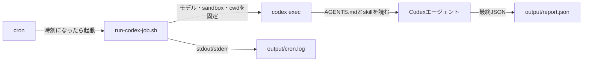
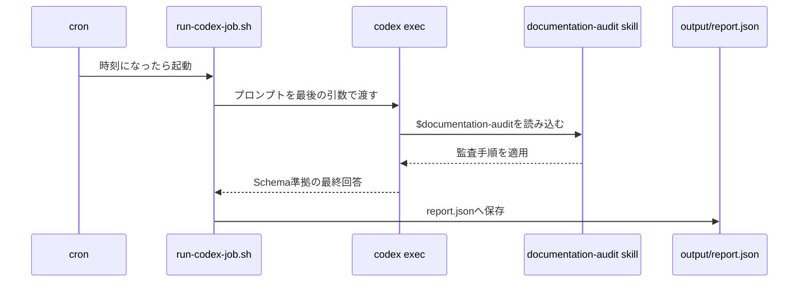

# cronでCodexを定期実行するスケジューラーを作る

## この構成で解決すること

「毎朝、運用ドキュメントを監査してJSONレポートを残す」のような定型作業は、Codexを起動しっぱなしにする必要がない。cronが時刻になったら `codex exec` を起動し、Codexは1回の作業を終えたら終了する。

ここでいうスケジューラーはCodex本体ではなく、cronと起動スクリプトの組み合わせである。cronは時刻を管理し、シェルスクリプトは実行条件を固定し、Codexはプロンプトとskillに従って作業する。



図で見るべき点は、cronがCodexへ直接指示を渡さないこと。設定の差を吸収するのは起動スクリプトであり、Codexへ渡す作業指示はプロンプトファイルに置く。

## 構成

最小構成は次のとおり。`output/` と認証情報はGitで追跡しない。

```text
codex-job/
├── AGENTS.md
├── .agents/skills/
│   └── documentation-audit/SKILL.md
├── prompts/
│   └── audit.md
├── schema/
│   └── report.schema.json
├── scripts/
│   ├── run-codex-job.sh
│   ├── install-cron-once.sh
│   └── remove-cron.sh
└── output/
```

- `AGENTS.md`: リポジトリ固有の禁止事項、検証方法、成果物の置き場所
- `SKILL.md`: 監査手順など、繰り返し使う作業手順
- `prompts/audit.md`: 今回の作業依頼。`$skill-name` を書けばskillを明示して呼び出せる
- `report.schema.json`: 後続処理が期待する最終出力の形式
- `run-codex-job.sh`: cronから呼ばれる唯一の入口

## 1. プロンプトとskillを分ける

プロンプトには対象と成果物を、skillには再利用する手順を置く。毎回の依頼へ「全ファイルを読む」「根拠に行番号を付ける」と書き続けるより、skillへ固定した方がばらつきが減る。

```md title="prompts/audit.md"
Use $documentation-audit.

Audit every Markdown file under `task/`. Do not modify files.
Return JSON that conforms exactly to `schema/report.schema.json`.
Every finding must include a file and line number as evidence.
```

```md title=".agents/skills/documentation-audit/SKILL.md"
---
name: documentation-audit
description: Review Markdown operational documents for contradictions and unsafe procedures.
---

1. Read every requested Markdown file before reaching conclusions.
2. Treat a finding as fact only when it includes file and line evidence.
3. Do not edit the audited documents.
```

## 2. cronから呼ぶ入口を作る

cronはログインシェルではない。通常のターミナルで暗黙に使えるカレントディレクトリ、PATH、モデル設定を前提にすると、定期実行だけ失敗する。そのため、起動スクリプトで必要な条件をすべて指定する。

```bash title="scripts/run-codex-job.sh"
#!/usr/bin/env bash
set -euo pipefail

# cronのカレントディレクトリは不定なので、スクリプト位置から絶対パスを求める。
repo_root="$(cd "$(dirname "${BASH_SOURCE[0]}")/.." && pwd)"

# 入力資料と生成物を混ぜない。失敗ログもこの配下へ残す。
output_dir="${OUTPUT_DIR:-$repo_root/output}"
mkdir -p "$output_dir"

# 非対話実行の条件を固定する。
# - model: ChatGPT認証で利用可能なモデルを明示する
# - read-only: 監査中に入力資料を変更させない
# - output-schema: 後続処理が扱えるJSON形式を固定する
# - output-last-message: 最終結果だけをファイルへ保存する
"${CODEX_BIN:-codex}" exec \
  --model "${CODEX_MODEL:-gpt-5.4}" \
  --sandbox read-only \
  --output-schema "$repo_root/schema/report.schema.json" \
  --output-last-message "$output_dir/report.json" \
  --cd "$repo_root" \
  "$(<"$repo_root/prompts/audit.md")"
```

最後の引数がCodexへの指示プロンプトである。`$(<file)` はファイル内容を展開するBashの記法で、実際には次の形で渡される。

```bash
codex exec [オプション...] "Use $documentation-audit. Audit every Markdown file..."
```

## 3. いきなり毎日登録しない

まず手動で一回動かし、JSONが生成されることを確認する。

```bash
cd /path/to/codex-job
bash scripts/run-codex-job.sh
cat output/report.json
```

次に、一回限りのcron定義を入れる。既存のcronジョブを消さず、今回のエントリだけを識別・解除できるようにmarkerを付ける。

```bash title="scripts/install-cron-once.sh"
#!/usr/bin/env bash
set -euo pipefail

repo_root="$(cd "$(dirname "${BASH_SOURCE[0]}")/.." && pwd)"
marker="# codex-job-once"
schedule="${CRON_SCHEDULE:?Set CRON_SCHEDULE, for example '17 2 * * *'}"
log_path="$repo_root/output/cron.log"

# 既存登録を読み、同じ検証エントリだけを置き換える。
existing="$(crontab -l 2>/dev/null || true)"
cleaned="$(printf '%s\n' "$existing" | grep -F -v "$marker" || true)"

# stdout/stderrを保存する。cronでは端末にエラーが表示されないため必須。
entry="$schedule cd '$repo_root' && '$repo_root/scripts/run-codex-job.sh' >> '$log_path' 2>&1 $marker"
printf '%s\n%s\n' "$cleaned" "$entry" | crontab -
```

実行時刻を指定して登録する。

```bash
CRON_SCHEDULE='30 2 * * *' bash scripts/install-cron-once.sh
crontab -l
```

確認後は必ず消す。

```bash title="scripts/remove-cron.sh"
#!/usr/bin/env bash
set -euo pipefail

# marker付きの行だけを消すので、他のcronジョブは残る。
marker="# codex-job-once"
existing="$(crontab -l 2>/dev/null || true)"
printf '%s\n' "$existing" | grep -F -v "$marker" | crontab -
```

## 4. 実行中に何が起きるか

`run-codex-job.sh` はプロンプトを最後の引数に渡す。Codexはプロジェクト内の `AGENTS.md` と `.agents/skills` を見つけ、必要なskillを読み込む。次に、読み取り専用sandbox内で対象ファイルを読み、最終回答をSchemaに合わせる。スクリプトはその最終回答を `output/report.json` に保存する。



この構成では、途中の思考やツール実行ログを後続処理へ渡さない。定期ジョブが扱うのは、検証済みの最終JSONと `cron.log` のみである。

## 動作確認のチェックリスト

1. `codex login` 済みの実行ユーザーで手動実行する。
2. `output/report.json` をJSONとして読み、必須フィールドを確認する。
3. `output/cron.log` に認証、モデル、PATHに関する失敗がないか確認する。
4. 一回限りのcronで同じスクリプトを実行する。
5. `crontab -l` で検証用エントリを解除したことを確認する。

実際の検証では、WSL Ubuntu上で `codex exec`、SDK、App Server、cronの全経路から同じ監査を実行し、行番号付きJSONが生成されることを確認した。具体的な比較とApp Server／SDKの使い分けは [Codex 自動実行の3方式を比較する](codex-automation.md) を参照する。

## 運用上の制約

- WSLのcronは、WSL自体が実行時刻まで動き続けなければ起動しない。PCのスリープやWSL停止をまたぐ必要がある処理には、常時稼働するLinuxホスト、Windowsタスクスケジューラ、またはCIのスケジューラーを使う。
- 認証とモデルは、対話環境と定期ジョブで差が出やすい。ジョブのスクリプトでモデルを明示し、定期的に手動の疎通確認を行う。
- 不要なMCPサーバーが設定されていると、起動時の認証エラーがログへ混ざる。定期ジョブ用には必要最小限の設定を使う。
- 監査のように書き込み不要な処理は `read-only` sandboxにする。修正を許す場合も、書き込み範囲とレビュー方法を別途設計する。
- APIキー、アクセストークン、監査対象の秘密情報をプロンプト、ログ、JSONレポートへ残さない。
