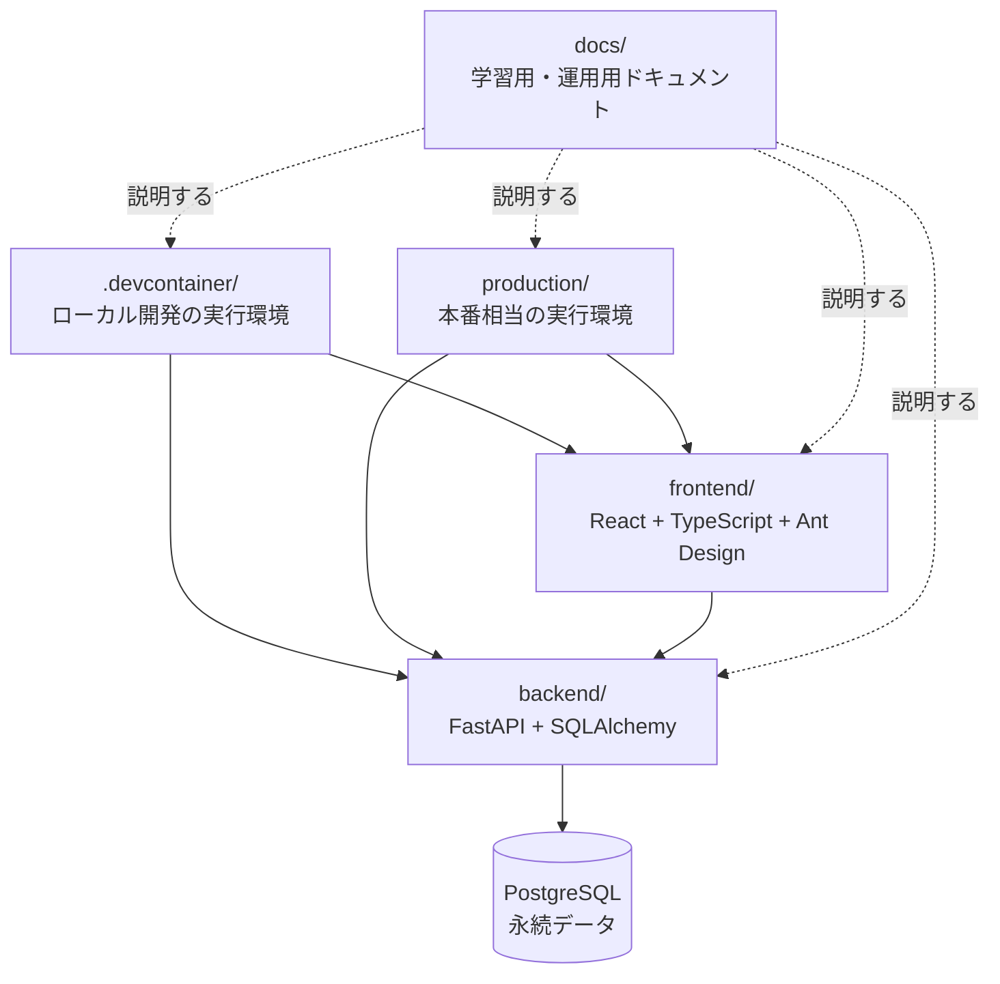

# sample: 全体構成と責務の境界

## このページで分かること

- `sample` がどのディレクトリに何を置いているか
- 開発環境と本番環境の設定を、アプリ本体と分ける理由
- FastAPIとReactのコードを、どの責務で分けているか
- コードレビューで「置き場所が適切か」を確認する方法

## 前提知識

- [Docker](../../technologies/README.md) は、アプリを動かす環境をまとめる仕組みです。
- FastAPIはPythonでHTTP APIを作るためのフレームワーク、Reactはブラウザ画面を作るためのライブラリです。
- PostgreSQLはデータを永続的に保存するデータベースです。

## まず結論

`sample` は「アプリが何をするか」と「アプリをどの環境で動かすか」を分けています。

- `backend/` と `frontend/` はアプリケーションコードです。
- `.devcontainer/` と `production/` は実行環境の設定です。
- `docs/` はコードの意図、運用手順、設計判断を説明する場所です。

この境界を保つと、例えば本番用のNginx設定を変更してもReactやFastAPIのコードを探し回らずに済みます。また、画面の仕様を変えてもDockerの起動方法を誤って変更する可能性を減らせます。

## プロジェクト全体



図の実線は実行時の関係、点線はドキュメントが説明する対象です。`docs/` 自体はアプリの処理に参加しません。人が理解・運用・レビューするための情報を置きます。

## ディレクトリごとの役割

| 場所 | このプロジェクトでの役割 | レビューで見ること |
| --- | --- | --- |
| [`.devcontainer/`](https://github.com/nyufufu777/sample/tree/main/.devcontainer) | ローカル開発用のDocker、Compose、Nginx、VS Code接続設定 | 開発時の便利さだけでなく、ホットリロードと通信経路が分かるか |
| [`production/`](https://github.com/nyufufu777/sample/tree/main/production) | 本番相当のDocker、Compose、Nginx、プロセス管理設定 | 開発専用の設定や秘密情報を持ち込んでいないか |
| [`backend/`](https://github.com/nyufufu777/sample/tree/main/backend) | FastAPIのAPIとDBアクセス | HTTP、業務ルール、DB操作が一か所に混ざっていないか |
| [`frontend/`](https://github.com/nyufufu777/sample/tree/main/frontend) | Reactの画面、API呼び出し、翻訳、テスト | 画面固有の関心事が不用意に共有化されていないか |
| [`docs/`](https://github.com/nyufufu777/sample/tree/main/docs) | 構成、設定、DB、テスト、レビューの説明 | 実装と矛盾していないか。更新手順が残っているか |

## 環境設定とアプリコードを分ける理由

DockerfileやComposeは「PythonやNode.jsをどう入れるか」「コンテナ同士をどうつなぐか」を決めます。これはアプリの業務ルールではなく、実行基盤の関心事です。

そのため `backend/Dockerfile` や `frontend/Dockerfile` のようにアプリ側へ置くのではなく、環境を表す `.devcontainer/` と `production/` に集めています。開発用と本番用では目的が異なるからです。

- 開発用: ソースコードをマウントし、ReactやFastAPIをすぐ再読み込みしたい。
- 本番用: 必要な成果物だけを含め、起動方法を固定したい。

同じDockerという技術を使っても、設定を一つに無理に統合すると、`if 開発環境なら...` のような条件が増えます。環境の差が明確なら、ファイルも分けた方が読みやすくなります。

## バックエンドの責務

`backend/app/` は、Kanbanのカードと列を扱うFastAPIアプリです。主な依存方向は次のとおりです。

```text
api/endpoints -> services -> repositories -> models / db
api/endpoints -> schemas
```

| 層 | 知ってよいこと | 知るべきでないことの例 |
| --- | --- | --- |
| `api/` | URL、HTTPメソッド、HTTPステータス、依存性注入 | SQLの細部、複雑な業務判断 |
| `schemas/` | APIで受け取る・返すJSONの形 | DBセッションの操作 |
| `services/` | カードを作成できる条件、処理順 | FastAPIの`Request`や画面表示 |
| `repositories/` | SQLAlchemyを使った検索・保存 | HTTPレスポンスの組み立て |
| `models/` / `db/` | テーブル、接続、トランザクション | 画面固有の表示ルール |

例えば「空のタイトルのカードを作成しない」は業務ルールなので`services/`に置きます。一方で「不正な入力ならHTTP 422を返す」はHTTP境界の役割なので`api/`と`schemas/`が関わります。

この分割は、フレームワークが強制するものではありません。小さいアプリで無意味にファイルを増やすための規則でもありません。HTTP、業務判断、DB操作が混ざり、変更やテストが難しくなったときに分けるための道具です。

## フロントエンドの責務

`frontend/src/` は、アプリ起動、画面、API通信、翻訳を分けます。

| 場所 | 役割 | 判断の目安 |
| --- | --- | --- |
| `app/` | Reactの起動、Provider、全体設定 | 業務ルールや特定画面の状態は置かない |
| `features/` | Kanbanのような業務機能ごとの画面・状態・API | 新しい機能はまずここへ置く |
| `components/` | 複数機能で共有するUI | 少なくとも複数箇所で共有するまで増やさない |
| `lib/` | フレームワークに依存しない小さな共通処理 | 「何でも入れるutils」にしない |
| `i18n/` | 日本語・英語の翻訳リソース | 画面上の文字列を直接散らさない |

機能単位で近くに置く理由は、変更理由が同じコードを一緒に見つけられるようにするためです。Kanban画面のUI、API呼び出し、型が別々の遠い場所に散ると、一つの機能を理解するだけで多くのディレクトリを横断することになります。

## レビューで見るポイント

1. **責務と置き場所が合っているか**: Nginx設定をReactのコンポーネントに置く、SQLをendpointへ直接書く、といった混在がないか確認します。
2. **依存方向が逆転していないか**: `repository`が`api`を呼ぶ、あるfeatureが別featureの内部へ直接依存する、といった逆向きの参照は変更を広げます。
3. **環境差を意識できているか**: 開発用のホットリロード設定を本番へ持ち込んでいないか、環境変数がコードへ埋め込まれていないかを確認します。
4. **ドキュメントが実装に追随しているか**: ディレクトリ追加や通信経路の変更時に、構成図・手順・リンクも更新されているかを見ます。

## よくある誤解・つまずき

- **「Dockerfileはアプリの近くに置くほどよい」**: Dockerfileが何を表すかで決めます。このプロジェクトでは環境を表すため、環境ディレクトリに置きます。
- **「層を分ければ必ず良い設計になる」**: 役割のない薄いファイルを量産すると、かえって追いにくくなります。混在の問題が出たときに分けます。
- **「`components/`は最初から共通部品の置き場」**: 共有がまだない部品はfeatureの近くに置きます。早すぎる共通化は変更理由の異なるコードを結び付けます。

## 関連ページ

- [sample: 画面からDBまでのリクエストフロー](request-flow.md)
- [プロジェクト解説の入口](../README.md)
- [設計判断の書き方](../../decisions/README.md)

## 参考資料

- [sample: architecture.md](https://github.com/nyufufu777/sample/blob/main/docs/architecture.md): 元プロジェクトの構成説明を確認する。
- [sample: directory-design.md](https://github.com/nyufufu777/sample/blob/main/docs/directory-design.md): ディレクトリを責務境界として扱う考え方を確認する。
