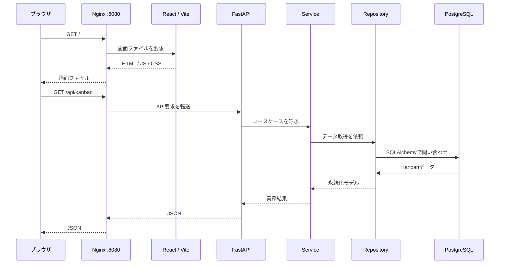

# sample: 画面からDBまでのリクエストフロー

## このページで分かること

- ブラウザでKanban画面を開いたときの通信経路
- ReactがAPIを呼び、FastAPIとPostgreSQLが応答を返すまでの担当分担
- Nginxを入口にする理由と、開発・本番で変わる点
- 通信やAPIをレビューするときに確認するポイント

## 前提知識

- [sample: 全体構成と責務の境界](overview.md)
- HTTPは、ブラウザなどのクライアントがサーバーへ要求を送り、応答を受け取るための約束です。

## まず結論

利用者は`frontend`や`backend`へ直接アクセスしません。まずNginxの`http://localhost:8080`へアクセスします。NginxがURLの先頭を見て、画面用の要求をReactへ、`/api/`で始まる要求をFastAPIへ渡します。

## 画面を開くとき

1. ブラウザが`http://localhost:8080/`へ`GET`要求を送ります。
2. Nginxは`/`への要求をfrontendへ渡します。開発環境ではVite、productionではビルド済みの静的ファイルを返す役割です。
3. ブラウザはHTML、JavaScript、CSSを受け取り、JavaScriptとしてReactアプリを実行します。
4. Reactは画面に必要なKanbanデータを取得するため、同じオリジンの`/api/`へ要求を送ります。

利用者から見ると一つの`localhost:8080`だけですが、内部では画面担当とAPI担当が分かれています。この形を**リバースプロキシ**と呼びます。Nginxが外部からの窓口になり、内部のサービス名やポート番号をブラウザへ直接見せません。

## APIを呼ぶとき

Kanbanの取得・作成・更新・削除は、FastAPIのendpointから始まります。具体的なURLと入力・出力の形は、[`backend/app/api/endpoints/kanban.py`](https://github.com/nyufufu777/sample/blob/main/backend/app/api/endpoints/kanban.py) と [`schemas/kanban.py`](https://github.com/nyufufu777/sample/blob/main/backend/app/schemas/kanban.py) で確認できます。

### 1. API endpoint

endpointはHTTPの境界です。URL、HTTPメソッド、入力の検証、成功・失敗時のHTTPステータスを扱います。ここでSQLを書いたり、複数の業務ルールを判断したりしないことが重要です。

### 2. Service

serviceは「カードをどの列に置けるか」「タイトルをどのように扱うか」のようなユースケースを扱います。HTTPに依存しない形で書けば、API経由ではないテストでもルールを確認できます。

### 3. Repository

repositoryはSQLAlchemy経由の検索・保存を担当します。serviceが`SELECT`や`JOIN`などの詳細を意識しなくてもよいように、DBアクセスをここへ閉じ込めます。

### 4. Model / Database

modelはテーブルとPythonオブジェクトの対応を表します。DBセッション、接続、migration、seedは`db/`にあります。PostgreSQLにデータが保存されることで、コンテナを再起動してもKanbanの状態を保てます。

## 開発環境と本番環境の違い

通信の入口はどちらもNginxの8080番ポートです。ただし、画面を返す担当が異なります。

| 環境 | `/`の行き先 | `/api/`の行き先 | 意図 |
| --- | --- | --- | --- |
| 開発 | Vite開発サーバー | backendコンテナのFastAPI | Reactのホットリロードを使う |
| 本番相当 | Nginxが持つビルド済み静的ファイル | 同一コンテナ内のFastAPI | 配信物と起動方法を固定する |

開発用のNginx設定では、Viteのホットリロードに必要なWebSocketの`Upgrade`ヘッダーもfrontendへ渡します。本番用ではViteを動かさず、React Routerの画面遷移で未知のパスにアクセスしても`index.html`へ戻す設定を持ちます。

設定の詳細は次のファイルで確認できます。

- [開発用 nginx.conf](https://github.com/nyufufu777/sample/blob/main/.devcontainer/nginx.conf)
- [本番用 nginx.conf](https://github.com/nyufufu777/sample/blob/main/production/nginx.conf)

## HTTPステータスコードの見方

APIレビューでは、成功・失敗をHTTPステータスで正しく表しているかを確認します。

| ステータス | 意味 | Kanbanでの例 |
| --- | --- | --- |
| `200 OK` | 正常に取得・更新できた | ボードの取得、カードの更新 |
| `201 Created` | 新しいデータを作成できた | 新しいカードを作成 |
| `404 Not Found` | 指定された対象がない | 存在しないカードIDを更新 |
| `422 Unprocessable Entity` | 形式や入力値がAPIの条件を満たさない | 必須のタイトルがない |
| `500 Internal Server Error` | サーバー内で予期しない問題が起きた | DB接続や実装上の問題 |

`400`、`422`、`404`を何でも同じエラーとして返すと、利用者も開発者も原因を判断しにくくなります。入力形式、存在確認、サーバー障害を分けて扱うことが、APIを読むときの重要な観点です。

## レビューで見るポイント

1. **URLの振り分けが一貫しているか**: `/api/`が常にFastAPIへ届き、画面のルーティングと混ざっていないかを確認します。
2. **同一オリジンの利点を活かせているか**: ブラウザはNginxだけをアクセス先として認識するため、開発用に余計なCORS設定を増やしていないかを確認します。
3. **endpointが薄いか**: endpointにSQLや複雑な業務判断が増えていないかを確認します。
4. **失敗を正しく返せるか**: 存在しないID、入力不正、DB障害を同じ成功応答にしていないかを確認します。
5. **環境差が意図どおりか**: 開発用のVite転送・WebSocket設定と、本番用の静的配信・SPAフォールバックを混同していないかを確認します。

## よくある誤解・つまずき

- **「NginxはただのWebサーバー」**: 静的ファイル配信だけでなく、要求を適切な内部サービスへ渡すリバースプロキシとしても使えます。
- **「ReactがDBへ直接アクセスする」**: ブラウザはDBへ直接つながりません。ReactはHTTP APIを呼び、FastAPI側がDBへアクセスします。
- **「CORSは必ず必要」**: ブラウザから見たオリジンが同じなら、通常はCORS問題は起きません。この構成ではNginxが同一オリジンの入口を作っています。
- **「HTTP 200なら成功」**: HTTP 200でエラー本文を返す設計は、クライアント側の失敗処理を難しくします。HTTPの意味に合うステータスを返します。

## 関連ページ

- [sample: 全体構成と責務の境界](overview.md)
- [プロジェクト解説の入口](../README.md)
- [技術別ノートの入口](../../technologies/README.md)

## 参考資料

- [sample: request-flow.md](https://github.com/nyufufu777/sample/blob/main/docs/request-flow.md): 元プロジェクトの簡潔な通信フローを確認する。
- [sample: kanban API](https://github.com/nyufufu777/sample/blob/main/docs/kanban-api.md): APIの実際のURL・入出力を確認する。
- [sample: Nginx開発設定](https://github.com/nyufufu777/sample/blob/main/.devcontainer/nginx.conf): 開発時のプロキシとホットリロード設定を確認する。
