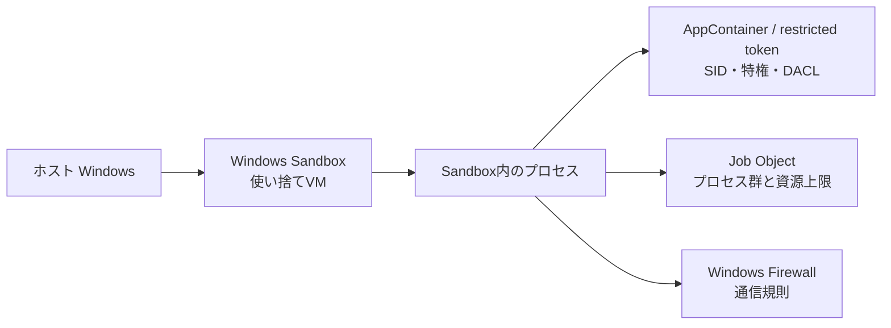

# WindowsでSandbox環境を組み立てる

Windows では、Linux の namespace を直接組み合わせる代わりに、仮想化を使う **Windows Sandbox**、プロセスの権限を落とす **AppContainer / restricted token**、資源をまとめて制限する **Job Object**、通信を制御する **Windows Firewall** を使い分ける。どれも「Sandbox」という名前で呼ばれ得るが、隔離する範囲が違う。

このページでは、まず Windows Sandbox で使い捨てのWindows環境を実際に起動する。後半では、アプリケーションがプロセス単位のSandboxを組み立てる際にOSへどの設定を渡すかを扱う。

> 注意: Windows Sandbox を有効化すると、Windowsのオプション機能と仮想化基盤が変更される。管理者権限と再起動が必要である。共有フォルダ、クリップボード、ネットワークを有効にすると、Sandboxからホストまたは社内ネットワークへ到達する経路が増える。

## どの層を組み立てるか



Windows Sandbox はホストと別の使い捨てWindows環境を起動するため、未知の実行ファイルを試す用途に向く。AppContainer・restricted token・Job Object は、同一Windows上でアプリケーションが子プロセスを制限するための部品である。後者だけで仮想マシン相当の隔離になるわけではない。

## 1. Windows Sandbox を有効化する

Windows Sandbox を使えるエディションと仮想化要件を満たしていることを確認する。機能の状態は管理者PowerShellで観測できる。

```powershell
Get-WindowsOptionalFeature -Online -FeatureName Containers-DisposableClientVM |
  Select-Object FeatureName, State
```

`State` が `Disabled` なら、管理者PowerShellで次を実行する。

```powershell
Enable-WindowsOptionalFeature -Online `
  -FeatureName Containers-DisposableClientVM `
  -All
```

Windows の再起動後、`Windows Sandbox` を起動できるようになる。この操作でホストの通常のプロセスがSandbox化されるのではない。Windows Sandbox用の使い捨て仮想化環境を起動できる状態になる。

## 2. ネットワークを切り、読み取り専用の入力だけを渡す

次の内容を `C:\Sandbox\offline-test.wsb` として保存する。先に `C:\Sandbox\Input` を作り、調べたいファイルだけを置く。

```xml
<Configuration>
  <VGpu>Disable</VGpu>
  <Networking>Disable</Networking>
  <ClipboardRedirection>Disable</ClipboardRedirection>
  <MappedFolders>
    <MappedFolder>
      <HostFolder>C:\Sandbox\Input</HostFolder>
      <SandboxFolder>C:\Input</SandboxFolder>
      <ReadOnly>true</ReadOnly>
    </MappedFolder>
  </MappedFolders>
  <LogonCommand>
    <Command>explorer.exe C:\Input</Command>
  </LogonCommand>
</Configuration>
```

`.wsb` ファイルを開くと、Windows は設定を読み、Sandbox用のVMを起動する。ログオン前に `C:\Sandbox\Input` がSandbox内の `C:\Input` へ共有され、`LogonCommand` が実行される。この構成で新しく生じる状態は次の通りである。

| 設定 | Sandbox内で作られる・変わる状態 | 残らないもの |
| --- | --- | --- |
| Windows Sandbox | ホストとは別の一時的なWindows環境 | Sandbox内で作ったローカルファイル、インストールしたアプリ |
| `Networking=Disable` | 外部へ出る仮想NIC経路を使わない | インターネット・社内ネットワークへの接続 |
| `MappedFolder` | `C:\Input` からホストのInputを参照する共有 | ホストの他のフォルダへの自動アクセス |
| `ReadOnly=true` | 共有フォルダへの書き込みを拒否する | 入力ファイルの完全な安全性。読むこと自体は可能 |
| `ClipboardRedirection=Disable` | ホストとSandbox間のコピー・貼り付け経路を閉じる | 手動の情報持ち出し経路のすべて |

Sandbox内で確認するには、PowerShellを開いて次を実行する。

```powershell
Get-ChildItem C:\Input
New-Item C:\Input\should-fail.txt -ItemType File
Get-NetAdapter
Test-NetConnection example.com -Port 443
```

読み取り専用共有への作成は失敗する。ネットワーク無効時の `Test-NetConnection` も成功しない。失敗の表示はWindowsのバージョンや実行環境で異なるため、エラー文そのものではなく「共有先への書き込み」と「外向き接続」が許可されていないことを確認する。

Windows Sandbox のウィンドウを閉じて削除を確認すると、VM内だけで作られたデータは破棄される。一方、mapped folder、クリップボード、ネットワークなどを有効化してホストへ渡った情報や変更は自動では戻らない。

## 3. 共有とネットワークを有効にする前に確認すること

Windows Sandbox は初期設定ではネットワークとクリップボード共有が有効である。したがって、設定ファイルを使わずに起動したSandboxは「完全にオフライン」ではない。

```text
ネットワークを有効化
  → Sandboxの仮想NICがホスト側の仮想スイッチへ接続される
  → 外部・社内資源へ到達できる可能性が生じる

書き込み可能な共有フォルダを設定
  → Sandbox内のプログラムがホストの同じファイルを変更できる

クリップボードを有効化
  → テキスト・ファイルをホストと相互に持ち込める
```

「VMだから安全」とは限らない。未知のファイルを調べるだけなら、ネットワーク無効、共有は読み取り専用、クリップボード無効を出発点にし、必要な経路だけを理由付きで戻す。

## 4. アプリ内でプロセスを制限する：AppContainer

Windows Sandbox が別環境を起動するのに対し、AppContainer は同一Windows上のプロセスへ低い整合性レベルと専用SIDを与える。WindowsはSID、access token、DACL（アクセス制御リスト）を照合して、ファイル、レジストリ、名前付きオブジェクトなどへのアクセスを判定する。

AppContainerを起動する実装は、概ね次の順でWindows APIを呼ぶ。

```text
CreateAppContainerProfile(name, ...)
  → AppContainer profileとPackage SIDを作る
  → LOCALAPPDATA / TEMP / TMP の専用領域が決まる

必要な能力(capability)をSECURITY_CAPABILITIESへ列挙
  → 何へ例外的に到達できるかを指定する

STARTUPINFOEX + PROC_THREAD_ATTRIBUTE_SECURITY_CAPABILITIES
  → CreateProcessで子プロセスをAppContainerとして起動する
```

プロファイル作成後に、AppContainerが使うフォルダを確認する例を示す。これはアプリ開発用の観測であり、AppContainerプロセスを起動するAPI呼び出し自体はアプリケーション側で実装する。

```powershell
# AppContainerで実行されたプロセスの例: 専用環境変数を確認する
Get-Item Env:LOCALAPPDATA, Env:TEMP, Env:TMP
whoami /groups
```

AppContainerの既定は「アクセスできない」である。ホストの任意フォルダを読むためには、対象DACLにAppContainerのSIDまたは適切なcapabilityを明示的に許可する必要がある。安易に広いフォルダへ許可を付けると、AppContainerを使う意味が薄れる。

## 5. restricted token と Job Object を重ねる

restricted token は既存のaccess tokenからSIDや特権を無効化・削除し、追加の制限SIDによるアクセスチェックを課す。`CreateRestrictedToken` で作成したトークンを `CreateProcessAsUser` へ渡すと、子プロセスは制限済みtokenで起動する。

Job Object はプロセス群を1単位として管理するWindowsのkernel objectである。`CreateJobObject` で空のJobを作り、`SetInformationJobObject` で上限を設定し、`AssignProcessToJobObject` で子プロセスを所属させる。

```text
CreateProcess(..., CREATE_SUSPENDED)
  → 子プロセスは実行前に停止した状態で作られる
CreateJobObject()
SetInformationJobObject(..., memory / active process / CPU limit)
AssignProcessToJobObject(job, child process)
ResumeThread()
  → 実行開始時からJobの上限を受ける
```

Jobへ所属したプロセスが作る子プロセスも、通常は同じJobの制約を引き継ぐ。Job Objectは資源とプロセスツリーを扱う部品であり、ファイルアクセスやネットワークを単独で禁止する部品ではない。そのためAppContainerやFirewallと組み合わせる。

## 6. Windows Firewallで通信規則を追加する

VMやAppContainerを使わず、特定プログラムの外向き通信だけを一時的に止めるなら、管理者PowerShellでFirewall規則を作る。対象は必ず絶対パスで指定する。

```powershell
$program = 'C:\Sandbox\Tools\untrusted.exe'

New-NetFirewallRule `
  -DisplayName 'Wiki Sandbox: block untrusted outbound' `
  -Direction Outbound `
  -Action Block `
  -Program $program `
  -Profile Any

Get-NetFirewallRule -DisplayName 'Wiki Sandbox: block untrusted outbound' |
  Get-NetFirewallApplicationFilter
```

この操作でFirewall policy storeに規則が追加される。プロセスが同じファイルを起動した場合の外向き通信をブロックするが、同一ファイルをコピー・改名した別パスの実行ファイルには自動では適用されない。またFirewallはファイル操作、レジストリ、プロセス生成を制限しない。

```powershell
Remove-NetFirewallRule -DisplayName 'Wiki Sandbox: block untrusted outbound'
```

後片付けは規則を明示的に削除する。Windows Sandboxを閉じるだけでは、ホスト側に作ったFirewall規則は消えない。

## Windows版の設計上の注意

| 目的 | 適する境界 | それだけでは足りないもの |
| --- | --- | --- |
| 未知の実行ファイルを短時間試す | Windows Sandbox + `.wsb` | 共有・クリップボード・ネットワークを有効にした経路 |
| アプリの子プロセスに最低限の権限を渡す | AppContainer / restricted token | CPU・メモリ・プロセス数の制限 |
| プロセスツリーを止め、資源上限を設ける | Job Object | ファイル・レジストリ・通信のアクセス制御 |
| 特定実行ファイルの通信を止める | Windows Firewall | 別パスのコピー、ファイル権限、プロセス権限 |

WindowsでのSandbox構築も、単一設定では完結しない。起動するプロセスのtoken、ファイル共有、通信規則、資源上限、VM境界を別々に設計し、PowerShellとWindows APIの観測で確認する。

## 関連記事と一次資料

- [構築：LinuxでSandbox環境を組み立てる](sandbox-build.md)
- [Sandboxの内部：OSが境界を作る仕組み](sandbox-internals.md)
- [Microsoft Learn: Windows Sandboxのインストール](https://learn.microsoft.com/en-us/windows/security/application-security/application-isolation/windows-sandbox/windows-sandbox-install)
- [Microsoft Learn: `.wsb`設定ファイル](https://learn.microsoft.com/en-us/windows/security/application-security/application-isolation/windows-sandbox/windows-sandbox-configure-using-wsb-file)
- [Microsoft Learn: Launch an AppContainer](https://learn.microsoft.com/en-us/windows/win32/secauthz/implementing-an-appcontainer)
- [Microsoft Learn: Job Objects](https://learn.microsoft.com/en-us/windows/win32/procthread/job-objects)
- [Microsoft Learn: CreateRestrictedToken](https://learn.microsoft.com/en-us/windows/win32/api/securitybaseapi/nf-securitybaseapi-createrestrictedtoken)
- [Microsoft Learn: New-NetFirewallRule](https://learn.microsoft.com/en-us/powershell/module/netsecurity/new-netfirewallrule)
