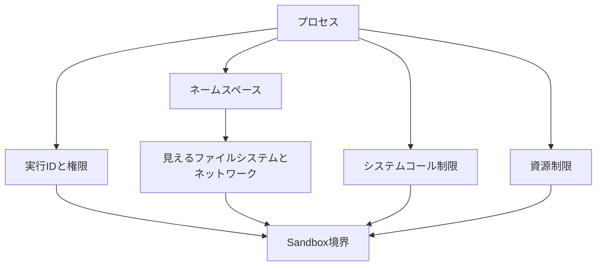
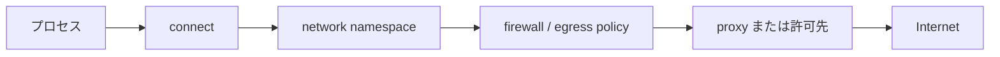

# Sandboxの内部：OSが境界を作る仕組み

Sandbox は、OS が持つ複数の隔離機構を重ねて作られます。重要なのは、どの機構が「見えるもの」「実行できること」「使える量」を制限するかを分けて理解することです。



プロセスを隔離するには、権限だけでは不十分です。見える資源、OS に要求できる操作、使える CPU・メモリも別々に制御します。

## プロセスと仮想メモリ

OS は、実行中のプログラムをプロセスとして管理します。プロセスには仮想メモリ、ファイルディスクリプタ、環境変数、実行 ID、プロセス ID が割り当てられます。通常、別プロセスのメモリを直接読むことはできません。仮想メモリとページ保護が最初の隔離境界です。

ただし、メモリの隔離だけではファイルやネットワークの操作を防げません。そのため、Sandbox はプロセスへ追加の制約を与えます。

## 実行IDとファイル権限

Unix 系 OS では、ファイルの所有者と UID/GID によって読み取り・書き込み・実行を判定します。

```text
-rw-------  user  secret.txt
```

この例では、所有者だけが `secret.txt` を読んだり書いたりできます。専用ユーザーでプロセスを起動すれば、ホスト上の重要ファイルへ届きにくくなります。

しかし、アクセス拒否だけではパス名やディレクトリ構造が見えることがあります。見える世界そのものを狭めるために、ファイルシステムの隔離が必要になります。

## ファイルシステムとネームスペース

Linux では mount namespace、`chroot`、コンテナのレイヤーファイルシステムなどを使い、プロセスから見えるディレクトリツリーを変えられます。

```text
ホストの /                 隔離されたプロセスから見える /
├─ home/                   ├─ workspace/
├─ etc/                    ├─ tmp/
├─ var/                    └─ usr/（必要な実行環境）
└─ workspace/
```

Sandbox 内の絶対パスとホストの絶対パスは、同じ文字列でも同じ実体を指すとは限りません。たとえば専用にマウントした `/tmp` は、ホストの `/tmp` と分離できます。ネームスペースの種類と具体例は [ネームスペースの記事](namespaces.md) で扱います。

## システムコール制限

ファイルを開く、プロセスを作る、ネットワークへ接続する、といった操作は最終的にシステムコールとして OS に渡されます。Linux の seccomp などは、プロセスが利用できるシステムコールや引数を制限します。

| システムコールの例 | 操作 | 制限する理由 |
| --- | --- | --- |
| `openat()` | ファイルを開く | 許可されないパスへの到達を防ぐ |
| `connect()` | 外部へ接続する | 通信の出口を制御する |
| `clone()` | プロセス・スレッドを作る | 子プロセスの増殖を抑える |
| `mount()` | ファイルシステムをマウントする | 新しい領域を勝手に見せない |

コマンド名が安全かどうかだけでは判断できません。最終的に OS へどの操作を要求するかを確認する必要があります。

## ネットワーク境界

ネットワーク通信は `connect()` だけで完結しません。network namespace、ファイアウォール、プロキシ、宛先の許可リストを重ねて出口を制御できます。



「ネットワークなし」は DNS だけを止めることではありません。IP アドレスを直接指定しても接続できないよう、出口を閉じる必要があります。逆に通信を許可する場合も、レジストリや社内 API など宛先を絞る方が安全です。

## 資源制限

無限ループ、巨大なビルド、fork bomb のような処理は、権限がなくてもホストの資源を消費します。Linux の cgroups や resource limit は、CPU、メモリ、ディスク、子プロセス数を制限します。

| 資源 | 上限に達したときの例 |
| --- | --- |
| CPU | 実行時間の制限、スケジューリングの抑制 |
| メモリ | 割り当て失敗、プロセスの終了 |
| プロセス数 | 子プロセスの作成失敗 |
| ディスク | 一時ファイルの書き込み失敗 |

テストが失敗した場合は、アプリケーションの失敗と資源制限を区別します。終了コード、メモリ使用量、ディスク残量、OS の記録を確認します。

## 層を重ねる理由

専用ユーザーだけでは見えるファイルが多く残り、ファイルシステムを分けてもネットワークが無制限なら外部へ送信できます。Sandbox は次のような複数層の組み合わせです。

```text
実行IDとファイル権限
  + ネームスペースとマウント
  + システムコール制限
  + ネットワーク出口制御
  + CPU・メモリ・プロセス数の上限
  = Sandbox
```

製品固有の「どの設定でどこまで実行できるか」は、OS の仕組みとは別に確認します。たとえば Codex の設定は [Codexのsandboxと承認](codex-sandbox.md) に分けています。

## コマンドが拒否されるまで：カーネルの判定経路を追う

シェルで入力したコマンドは、直接ファイルやネットワークを操作するわけではありません。シェルが子プロセスを起動し、そのプロセスが system call（ユーザー空間のプログラムがカーネルへ操作を依頼する入口）を発行します。カーネルはその時点の名前空間、マウント、UID/GID、アクセス制御、seccomp、資源上限を照合して結果を返します。

### 例1：ファイルへ書き込む場合

```text
echo result > /workspace/out.txt
  → シェルがファイルを開くため openat() を呼ぶ
  → seccomp が openat() や指定されたフラグを許可するか確認する
  → mount namespace が /workspace の実体を決める
  → カーネルが UID/GID、ACL、read-only mount を確認する
  → 許可: ファイル記述子を返す / 拒否: -EACCES や -EROFS を返す
  → 許可された場合だけ write() が内容を書き込む
```

`Permission denied` はアプリケーションが壊れたという意味ではありません。カーネルから `EACCES`（アクセス拒否）が返った可能性があります。一方、読み取り専用のマウントでは `EROFS` が返ります。どちらも「パスの文字列が正しいか」とは別の層の問題です。

### 例2：HTTPSへ接続する場合

```text
curl https://api.example.test/data
  → curl プロセスが DNS を問い合わせる
  → socket() で通信口を作り、connect() で接続を依頼する
  → network namespace のNIC・経路・DNS設定が参照される
  → egress policy、firewall、proxy、宛先許可リストが出口を判定する
  → 許可: TCP/TLS接続へ進む / 拒否: timeout、connection refused、policy error など
```

DNS の成功はインターネットへの到達を保証しません。名前解決、ルーティング、TCP接続、TLS、HTTP認証は別々の段階です。どの段階で止まったかを分けると、通信失敗を「ネットワークが使えない」と一括りにせず調査できます。

## 失敗を制限レイヤーへ結び付ける

書き込みや設定変更を試す前に、観測だけを行います。以下は Linux の代表例です。Sandbox によってコマンド自体が許可されない場合があるため、その場合は実行環境の診断機能や管理者向けログを確認します。なお、`curl -v` は状態を変更しない `GET` でも外部へリクエストを送信し、相手側にアクセスログを残します。外部通信の許可範囲を確認してから使います。

| 症状 | まず疑う層 | 読み取り中心の観測例 | 読み方 |
| --- | --- | --- | --- |
| `Permission denied` | UID/GID、ACL、書き込み権限 | `id`、`ls -ld /target`、`getfacl /target` | 実行ユーザーと所有者・権限ビット・ACLの対応を見る |
| `Read-only file system` | mount namespace、read-only mount | `findmnt -T /target`、`mount` | 対象パスを含むマウントが `ro` か確認する |
| 接続 timeout | network namespace、経路、egress policy | `ip route`、`getent hosts example.com`、`curl -v` | DNS、経路、TCP接続のどこまで進んだかを見る |
| `Killed`、OOM | cgroupまたはOSのメモリ上限 | `cat /sys/fs/cgroup/memory.max`、`cat /sys/fs/cgroup/memory.events` | `oom_kill` の増加や上限値を確認する |
| `Operation not permitted` | capability、seccomp、カーネル方針 | `capsh --print`、`grep -E 'Seccomp|Cap' /proc/$$/status` | 特権能力またはsystem callの制限を疑う |

観測コマンドは、拒否の理由を必ず特定する魔法ではありません。例えば `connect()` の拒否は、コンテナの外側にあるクラウドの egress policy で起きることもあります。その場合、Sandbox 内からは「timeout」という症状だけが見えます。見えている事実と、外側にあるかもしれない制御を区別することが重要です。

## 一次資料

- [Linux man-pages: namespaces(7)](https://man7.org/linux/man-pages/man7/namespaces.7.html)
- [Linux man-pages: seccomp(2)](https://man7.org/linux/man-pages/man2/seccomp.2.html)
- [Linux kernel documentation: Control Group v2](https://docs.kernel.org/admin-guide/cgroup-v2.html)
