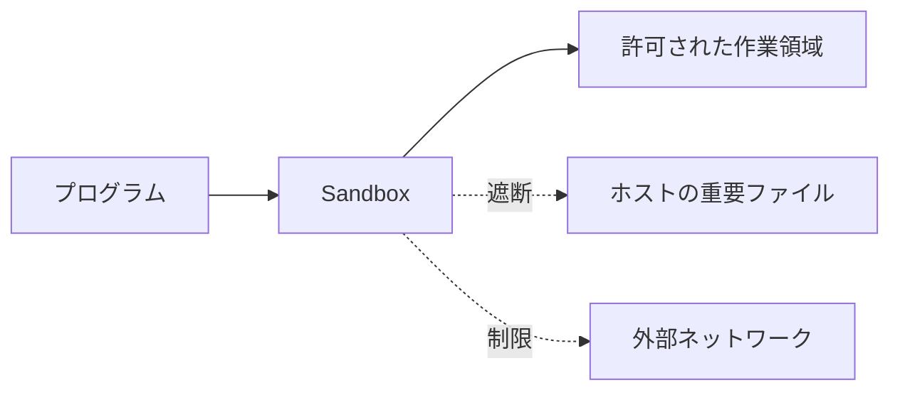

# Sandbox入門：隔離・権限・調査の出発点

Sandbox（サンドボックス）は、プログラムが触れられる範囲をあらかじめ限定して実行する環境です。許可されていないファイル、ネットワーク、OS 機能へ到達できないようにし、作業の影響を狭めます。

## Sandbox が必要になる場面

外部から受け取ったプログラム、生成したコード、拡張機能、ビルドツールには、意図しない操作が含まれる可能性があります。Sandbox は「信頼できないから実行しない」と「無制限に実行する」の間に置く安全境界です。



この図で重要なのは、Sandbox がプログラムを消すのではなく、到達可能な資源を選別する点です。

## 何を制限するか

| 対象 | 制限する内容 | 例 |
| --- | --- | --- |
| ファイル | 読み書きできるパス | プロジェクト内のみ編集可能 |
| ネットワーク | 接続先・通信の有無 | パッケージ取得や外部 API 呼び出しを遮断 |
| プロセス | 起動できる子プロセスや権限 | 管理者権限での実行を禁止 |
| 資源 | CPU、メモリ、ディスク、プロセス数 | 無限ループや巨大ビルドの影響を抑制 |

Sandbox は単一の機能ではありません。OS の権限、ファイルシステム、ネットワーク、資源制限を組み合わせて境界を作ります。

## 拒否された操作を読む

Sandbox による拒否は、コマンドの文法やアプリケーションのコードが誤っていることを直接意味しません。「対象のパス」「ネットワーク」「実行権限」のいずれかが許可範囲外である場合があります。

```text
npm test
  → ローカル実行。テスト出力やキャッシュへの書き込みはあり得る。

pip install -r requirements.txt
  → 外部ネットワークとローカルへの書き込みが必要になる。

git push origin branch
  → リモートサービスの状態を変更する。
```

拒否を受けた場合は、境界を広く緩める前に、必要な対象を分解します。たとえば依存関係の取得であれば、取得するパッケージ、接続先、書き込み先を特定してから、必要最小限の許可を検討します。

## 調査の順序

Sandbox 環境を調査するときは、書き込みを伴わない確認から始めます。

1. 現在の作業ディレクトリと、見えるファイルを確認する。
2. 読み取り・書き込み可能なパスを確認する。
3. DNS、HTTPS、外部 API のどの段階で通信が止まるかを確認する。
4. CPU、メモリ、ディスク、子プロセス数の上限を確認する。
5. 必要な例外だけを明示して再試行する。

内部の実装は [Sandboxの内部：OSが境界を作る仕組み](sandbox-internals.md)、Linux のネームスペースは [ネームスペース：プロセスごとに見える世界を分ける](namespaces.md) を参照してください。製品固有の権限設定は、それぞれの製品の設定記事で扱います。
